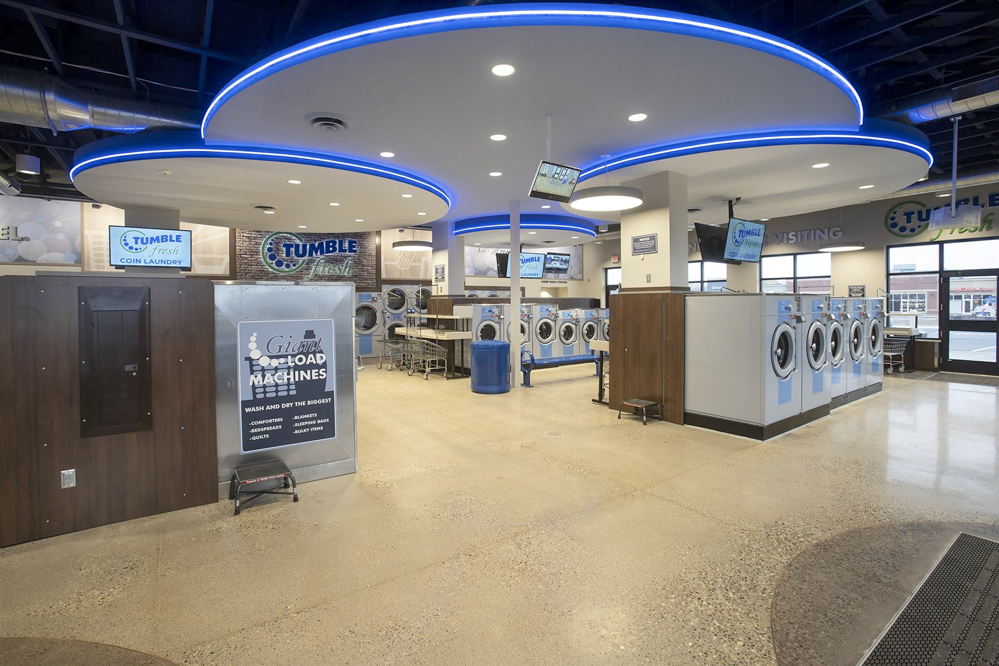
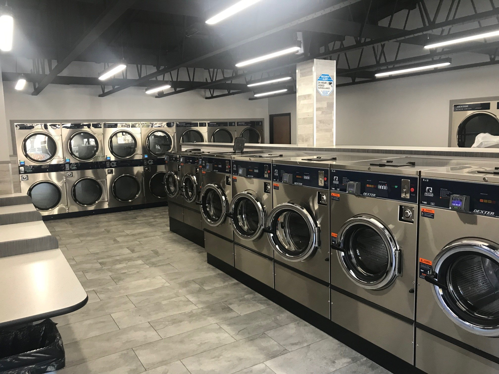
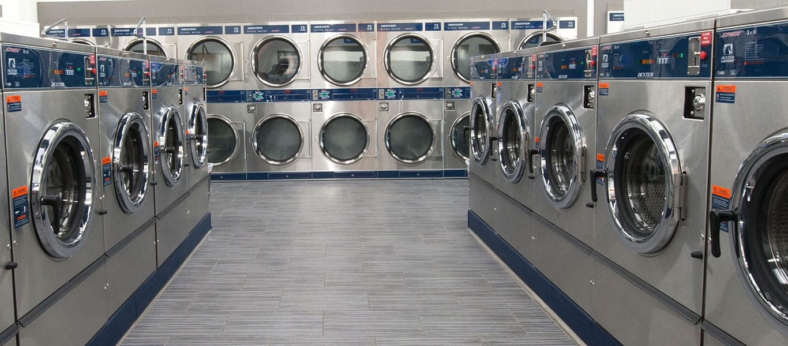
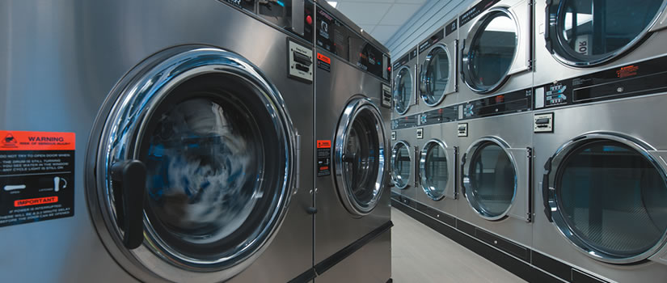
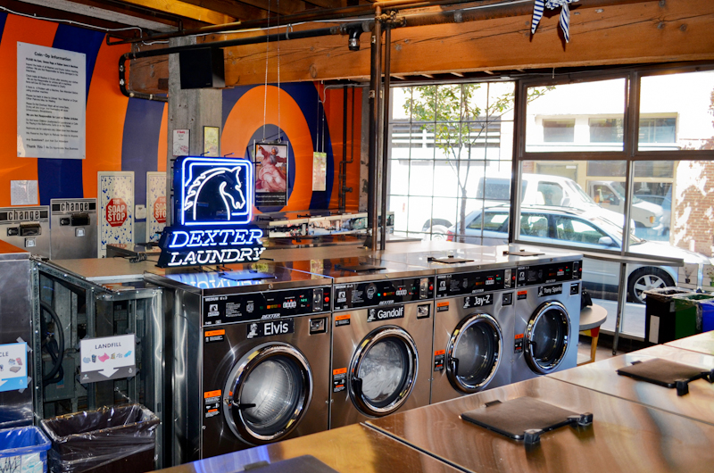
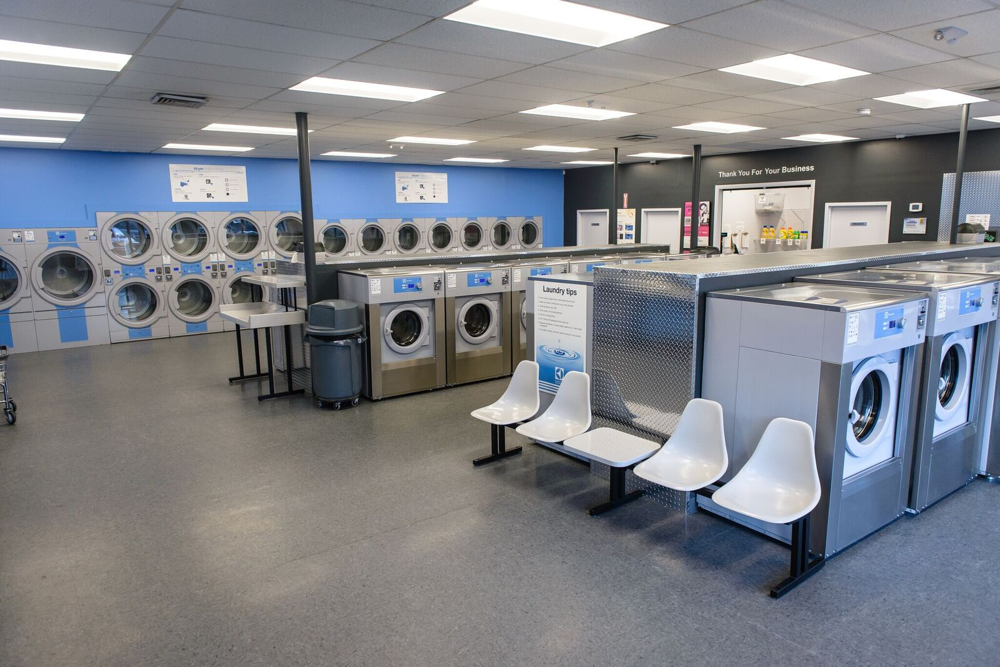
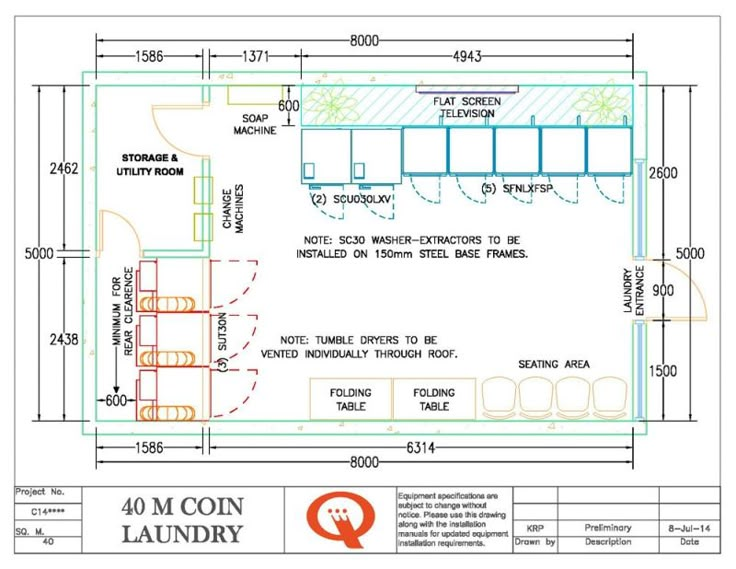
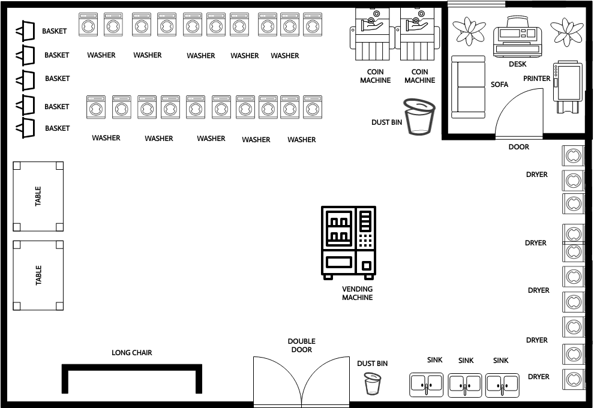
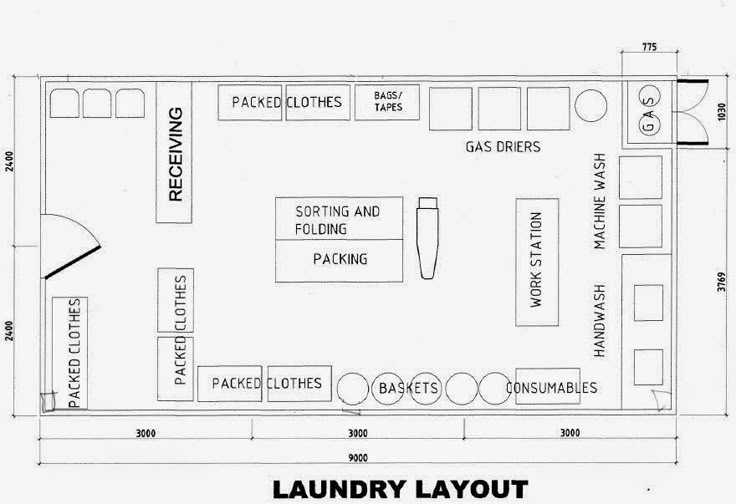
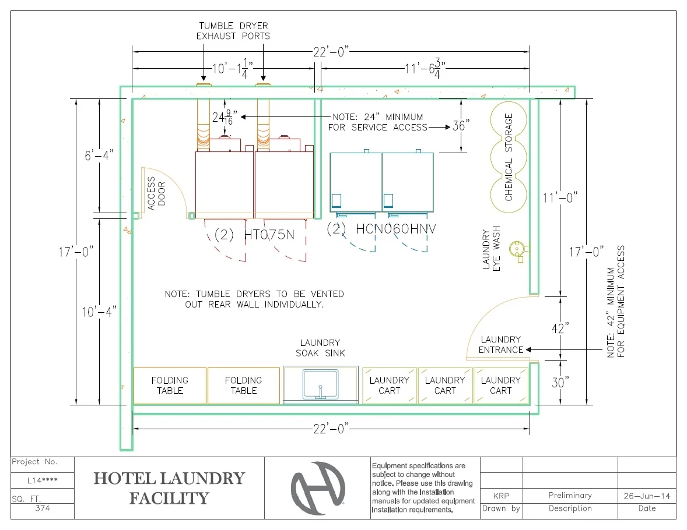

# THE LAUNDROMAT DOCTRINE

---

## A Three-Generation Playbook for Building, Optimizing, and Scaling Profitable Stores

---

### By Nicholas "Stroked-Out Sasquatch" Kremers

### With Lawrence "Laundromat Larry" Larsen

---

**Stroke Lyfe Publishing**

**WashBizHub.com**

---

*Apply this, wash away the BS, build wealth.*

---

## Copyright

Copyright © 2025 by Nicholas Kremers / Stroke Lyfe Inc.

All rights reserved. No part of this book may be reproduced, distributed, or transmitted in any form or by any means, including photocopying, recording, or other electronic or mechanical methods, without the prior written permission of the publisher, except in the case of brief quotations embodied in critical reviews and certain other noncommercial uses permitted by copyright law.

**ISBN:** 978-1-XXXXXX-XX-X *(To be assigned)*

**Publisher:** Stroke Lyfe Publishing  
**Website:** WashBizHub.com  
**Contact:** info@washbizhub.com

**First Edition:** 2025

**Cover Design:** *(To be assigned)*  
**Interior Design:** Professional KDP Formatting

Printed in the United States of America

**Disclaimer:** This book provides general information about the laundromat business. While the authors have made every effort to ensure accuracy, the information is provided "as is" without warranty. Business success depends on many factors, and individual results will vary. Readers should consult with qualified professionals (attorneys, accountants, contractors) before making business decisions. The authors and publisher disclaim any liability for losses or damages arising from the use of information in this book.

---

## Dedication

For **Debbie**, who taught me discipline.

For **Dad**, who taught me grit.

For **Grandpa Jerry**, who started it all with a pickup truck full of quarters.

For **Larry Larsen**, who's been doing this longer than I've been alive.

And for every operator rebuilding from the ground up — whether you're a single mom juggling kids and coin drops, a first-timer with more dreams than dollars, or a seasoned investor looking to scale.

You're not just washing clothes — you're building something that lasts.

---

## Table of Contents

### Front Matter
- Dedication
- Foreword by Larry "Laundromat Larry" Larsen
- Preface: Legacy and Grit
- How to Use This Book
- List of Figures

### PART I: FOUNDATIONS OF A LEGACY
- Chapter 1: The Three-Generation Blueprint
- Chapter 2: The Truth About This Business
- Chapter 3: Location Is Law
- Chapter 4: Lease Logic and Negotiation Survival

### PART II: BUILDING THE MACHINE
- Chapter 5: Equipment Intelligence
- Chapter 6: The Great Debate — Softmount vs. Hardmount
- Chapter 7: Top Loaders — Myths, Truths, and When They Make Sense
- Chapter 8: Design, Layout, and Customer Flow
- Chapter 9: Funding the Dream

### PART III: OPERATIONS & PROTECTION
- Chapter 10: Clean Operations — Efficiency, Maintenance, and Cost Control
- Chapter 11: Insurance & Liability Protection — Larry's Complete Guide
- Chapter 12: Fire Prevention & Safety — Protecting Your Investment
- Chapter 13: Staffing and Human Systems

### PART IV: GROWTH, MARKETING & EXIT
- Chapter 14: Marketing That Works
- Chapter 15: The Laundromat Success Doctrine
- Chapter 16: Scaling Smart — The Multi-Store Mindset
- Chapter 17: Selling or Passing the Torch

### APPENDICES & RESOURCES
- Appendix A: The Kremers Doctrine (Summary)
- Appendix B: Funding & Lender Index
- Appendix C: Due Diligence Master Checklist (Larry Larsen Method)
- Appendix D: Water Bill Analysis Tutorial
- Appendix E: Equipment Specifications Quick Reference
- Appendix F: Build vs. Buy Decision Matrix
- Appendix G: Insurance Coverage Checklist
- Appendix H: Fire Safety Inspection Checklist
- Appendix I: Lease Red Flags — Larry's 50 Traps to Avoid
- Appendix J: Industry Resources & Associations
- Appendix K: First-Time Buyer Q&A

### Back Matter
- Epilogue: The Legacy Load
- About the Authors

---

## List of Figures

### Chapter 3: Location Is Law
- **Figure 3.1:** CLEANBI Score Breakdown
- **Figure 3.2:** Location Decision Flowchart

### Chapter 5: Equipment Intelligence
- **Figure 5.1:** Premium Boutique Laundromat with Brand Identity (Tumble Fresh)
- **Figure 5.2:** Modern Dexter Store with Full Equipment Range
- **Figure 5.3:** Clean Aisle Configuration with Stacked Equipment
- **Figure 5.4:** Front-Loaders in Operation
- **Figure 5.5:** Boutique Laundromat with Personality (Named Machines)

### Chapter 6: Softmount vs. Hardmount
- **Figure 6.1:** Softmount vs. Hardmount Visual Comparison
- **Figure 6.2:** Total Cost of Ownership Over 15 Years

### Chapter 8: Design, Layout, and Customer Flow
- **Figure 8.1:** Modern Premium Laundromat Interior
- **Figure 8.2:** Self-Service Coin Laundry Layout (40 sq. meters / ~430 sq. ft.)
- **Figure 8.3:** Large Format Laundromat Layout
- **Figure 8.4:** Commercial WDF (Wash-Dry-Fold) Layout
- **Figure 8.5:** Hotel/Commercial Laundry Facility (374 sq. ft.)

### Chapter 12: Fire Prevention & Safety
- **Figure 12.1:** Lint Accumulation Danger Zones
- **Figure 12.2:** Fire Safety Equipment Placement

### Appendix C: Due Diligence Master Checklist
- **Figure C.1:** Due Diligence Workflow (4-6 Week Timeline)
- **Figure C.2:** Due Diligence Decision Tree

### Appendix D: Water Bill Analysis Tutorial
- **Figure D.1:** Water Bill Analysis Flowchart
- **Figure D.2:** Water Usage by Machine Type

---

## Foreword

### by Larry "Laundromat Larry" Larsen
*Founder of Laundromat123.com | 50+ Years in the Industry*

---

The laundromat business isn't complicated — it's just unforgiving.

You either do your homework, or the industry will educate you the hard way. And trust me, that education costs a hell of a lot more than any book or consultation ever will.

I've been in this business for over fifty years. I've seen everything — the booms, the busts, the operators who made millions and the ones who lost their shirts. The difference between them wasn't luck. It was preparation.

Nick Kremers knows this world from the ground up. Three generations of Arkansas laundry blood runs through his veins:

- **Jerry Kremers** hauling coin boxes through backroads in a beat-up pickup
- **Guy Kremers** fixing Dexters by hand during power outages
- **Nick** dragging himself back from a wheelchair after a stroke at 35 to re-engineer what "modern laundry intelligence" really means

This book is different because it's **lived** — not just learned.

Nick takes every scar, every repair bill, every late-night cleanout and turns it into structure. He understands that the coin laundromat business is a systems game. You win by design, not by luck.

I've been doing this longer than most people have been alive. And I can tell you: the principles in this book are the same ones that separate the operators who thrive from the ones who barely survive.

**What I've added to this book:**

Over the years, I've written extensively about the topics that trip up most operators — insurance coverage gaps that leave you exposed, fire hazards that destroy stores overnight, lease traps that kill your exit options, and equipment decisions that cost you tens of thousands. Nick and I have combined our knowledge into something I wish I'd had when I started fifty years ago.

If you read this book carefully — and more importantly, **apply it** — you'll not only learn how to buy, build, and run a profitable laundromat, but how to build a real foundation that protects your investment and your family.

This is the blueprint I wish every new owner had.

**— Larry "Laundromat Larry" Larsen**  
Laundromat123.com  
Author of *Secrets of Buying & Selling a Laundromat*

---

## Preface: Legacy and Grit

---

This book was born from grease, debt, and stubbornness.

I grew up with it — the smell of soap and lint, the clang of quarters in my grandfather's Speed Queen machines. I've seen this business at its best and worst — when the dryers hum with profit and when leaks eat away at your sanity.

But more than that, I've seen what the right structure can do.

Let me tell you about my family.

**Grandpa Jerry** ran Speed Queen routes through Arkansas long before "passive income" was a buzzword. He'd drive that old Ford pickup from store to store, hauling coin boxes that weighed more than my backpack ever did. He taught me that clean clothes were just the surface — the real business was dependability.

**Dad (Guy Kremers)** carried the torch with Kremers Laundry Equipment Company. He sold, repaired, and designed laundromats back when everything was still quarters and keys. He rebuilt Maytag 5-light top loaders, installed Dexters, and designed self-service layouts that still stand today. I grew up in the back of that service truck. My first toolkit came before my first report card.

Then came me — the third generation. I learned to lift machines before I learned to balance a checkbook.

### The Stroke That Changed Everything

That legacy didn't end when a stroke almost took me out at 35.

One day I'm running service calls. The next day I'm in a hospital bed wondering if I'll ever walk again.

But here's the thing about the Kremers way: we don't quit. We adapt.

What started as survival became a doctrine — structure, discipline, and accountability. The same systems thinking that makes a laundromat profitable is what got me back on my feet.

That mindset drives this book.

### Why This Book Exists

A laundromat is one of the last true neighborhood businesses that can still change a life if you do it right — with heart, discipline, and a little grit.

This book isn't theory. It's a manual forged from experience — from our family's three-generation playbook, combined with today's tools and truths. Add in Larry Larsen's fifty-plus years of industry expertise, and you've got more combined laundromat knowledge than just about anywhere else on the planet.

**What You'll Learn:**

- How to evaluate locations using the C.L.E.A.N. methodology
- Equipment selection strategies that maximize ROI
- The softmount vs. hardmount debate — finally settled
- Lease negotiation tactics that protect your investment
- Insurance coverage requirements that actually protect you
- Fire prevention protocols that save lives and stores
- Operational systems that scale across multiple stores
- Marketing strategies that actually drive revenue
- Exit planning that maximizes business value
- The complete Kremers Doctrine (C.L.E.A.N., W.A.S.H., L.A.U.N.D.R.Y., S.O.A.P., D.R.Y.)

**Who This Book Is For:**

- First-time laundromat buyers evaluating opportunities
- Current operators looking to optimize existing stores
- Investors seeking to add laundromats to their portfolio
- Single parents building a business while raising a family
- Anyone rebuilding after setbacks (like I did)
- Equipment distributors wanting to understand buyer perspectives

Let's get to work.

**— Nick**  
*The Stroked-Out Sasquatch*

---

## How to Use This Book

---

This ain't a novel. You don't have to read it front to back.

Here's my recommendation based on where you're at:

### If You're Just Starting to Research:
1. Read Chapters 1-4 (Foundations)
2. Jump to Appendix K (First-Time Buyer Q&A)
3. Then read Chapter 15 (The Doctrine)

### If You're Ready to Buy:
1. Start with Appendix C (Due Diligence Checklist)
2. Read Chapters 3-4 (Location and Lease)
3. Study Appendix D (Water Bill Analysis)
4. Review Chapter 9 (Funding)
5. **Critical:** Read Chapter 11 (Insurance) before closing

### If You Already Own a Laundromat:
1. Jump to Chapters 10-13 (Operations, Insurance, Safety, Staffing)
2. Study Chapter 15 (The Doctrine) for optimization
3. Read Chapter 16 (Scaling) when you're ready to grow

### If You're Planning to Sell:
1. Start with Chapter 17 (Exit Strategy)
2. Review your metrics against Chapter 15
3. Ensure your documentation is buyer-ready

### The Workbook Sections

Throughout this book, you'll find **WORKBOOK** sections marked with a box icon. These are designed for you to fill out, calculate, and apply directly to your situation.

### The Doctrine Tips

Watch for blockquotes like this:

> "Form over function. Structure over emotion. Design over guesswork."

These are Doctrine Tips — distilled wisdom from three generations and fifty-plus combined years of doing this. Tattoo them on your brain.

---

# PART I

## FOUNDATIONS OF A LEGACY

---

> "You don't just build a laundromat. You architect one — every lease, machine, and inch of tile is a decision that either compounds or collapses."

---

## Chapter 1: The Three-Generation Blueprint

---

The Kremers family didn't find the laundry business — it found us.

My grandfather **Jerry** ran Speed Queen routes through Arkansas long before "passive income" was a buzzword. He taught me that clean clothes were just the surface — the real business was dependability.

Dad carried the torch with **Kremers Laundry Equipment Company**. He sold, repaired, and designed laundromats back when everything was still quarters and keys. He rebuilt Maytag 5-light top loaders, installed Dexters, and designed self-service layouts that still stand today.

Then came me — the third generation. I grew up in the back of a service truck. My first toolkit came before my first report card. I learned to lift machines before I learned to balance a checkbook.

### The Stroke That Changed Everything

That legacy didn't end when a stroke almost took me out at 35. It just shifted focus.

What started as survival became a doctrine — structure, discipline, and accountability. That same mindset drives this book.

### The Modern Approach

You don't just build a laundromat. You **architect** one — every lease, machine, and inch of tile is a decision that either compounds or collapses.

### The Three Pillars of the Kremers Way

| Pillar | Principle | Application |
|--------|-----------|-------------|
| **1. Foundation First** | Location and lease determine 80% of success | Never compromise on site selection |
| **2. Systems Over Hustle** | Design beats improvisation every time | Document everything, automate what you can |
| **3. Numbers Don't Lie** | Track metrics religiously or fail slowly | Weekly reviews, monthly deep-dives |

That's the Kremers way. That's what this book will teach you.

### The Evolution of the Industry

| Era | Technology | Revenue Model | Key Challenge |
|-----|------------|---------------|---------------|
| 1950s-1970s | Coin-op only | Quarters | Machine reliability |
| 1980s-1990s | Card readers emerge | Mixed payment | Customer education |
| 2000s-2010s | Digital payments | Cards + coins | Technology adoption |
| 2020s+ | App-based, IoT | Subscription + per-use | Integration complexity |

The business has changed. The fundamentals haven't.

---

### WORKBOOK: Your Laundromat Vision

Answer these questions before you buy or build:

**1. Why do you want to own a laundromat?**
- [ ] Passive income goal  
- [ ] Career change  
- [ ] Portfolio diversification  
- [ ] Family business legacy  
- [ ] Other: _________________

**2. What's your experience level?**
- [ ] Complete beginner  
- [ ] Some business experience (not laundry)  
- [ ] Have worked in a laundromat  
- [ ] Currently own/manage one  

**3. What's your capital situation?**
- [ ] Under $50,000  
- [ ] $50,000-$150,000  
- [ ] $150,000-$300,000  
- [ ] $300,000+  

**4. What's your time commitment?**
- [ ] Fully hands-off (need manager)  
- [ ] Part-time (10-20 hrs/week)  
- [ ] Full-time (40+ hrs/week)  

**5. What's your 5-year goal?**
- [ ] Single profitable store  
- [ ] 2-3 store portfolio  
- [ ] 5+ store empire  
- [ ] Buy, optimize, flip  

---

## Chapter 2: The Truth About This Business

---

Let's be real: laundromats are not "easy money."

They're **steady money** if you design them right.  
They're **freedom** if you manage them like a business, not a hobby.  
And they're **hell** if you skip due diligence.

### Why First-Time Buyers Fail

There's a reason so many first-time buyers fail — they chase revenue and ignore rent. They look at the quarters, not the cracks in the lease.

**The Top 10 Reasons Laundromat Buyers Fail:**

1. **Paid too much** — Bought on emotion, not numbers
2. **Bad lease** — Short terms, high rent, no protections
3. **Wrong location** — Low density, bad demographics
4. **Undercapitalized** — No reserve for repairs or slow months
5. **Poor due diligence** — Trusted seller's numbers without verification
6. **Equipment neglect** — Deferred maintenance until breakdown
7. **No systems** — Winging it instead of designing processes
8. **Utility ignorance** — Water/gas eating all the profit
9. **Competition blind** — New store opened next door
10. **Burnout** — Treated it as a job, not a business

### The Four Organs of a Laundromat

You're buying a living, breathing ecosystem. Every laundromat has **four main organs:**

| Organ | What It Does | If It Fails |
|-------|--------------|-------------|
| **Lease** | Controls your existence | Slow death — can't control costs, can't sell |
| **Equipment** | Generates revenue | Lost revenue, angry customers, repair spiral |
| **Utilities** | Enables operations | Profits evaporate silently |
| **Community** | Brings customers | Empty machines, declining revenue |

If one of those fails, the body starts to die.

### The Core Principle

Every chapter in this book comes back to one core principle:

> "Form over function. Structure over emotion. Design over guesswork."

When you treat your laundromat like a living system — not a side hustle — it rewards you with freedom, recurring revenue, and longevity.

### Reality Check: The Numbers

**Typical Laundromat Economics:**

| Metric | Range | Notes |
|--------|-------|-------|
| **Annual Revenue** | $100K-$500K | Varies by size and location |
| **Net Margin** | 25-40% | Well-run stores hit 35%+ |
| **Payback Period** | 4-7 years | Faster if you optimize |
| **Time to Breakeven** | 18-36 months | New builds take longer |
| **Active Management** | 10-20 hrs/week | Initially; decreases with systems |

**Revenue Breakdown (Typical Store):**

| Source | Percentage |
|--------|------------|
| Self-service washers | 50-60% |
| Self-service dryers | 25-30% |
| Wash-dry-fold service | 10-20% |
| Vending/other | 2-5% |

**Expense Breakdown (Typical Store):**

| Category | Percentage of Revenue |
|----------|----------------------|
| Rent | 15-25% |
| Utilities | 15-25% |
| Labor | 5-15% |
| Maintenance/Repairs | 5-10% |
| Insurance | 2-4% |
| Supplies | 2-4% |
| Other (marketing, etc.) | 3-5% |
| **Net Profit** | **25-40%** |

This isn't passive income. It's **systematized** income.

---

### WORKBOOK: Financial Reality Check

Before you buy, calculate YOUR numbers:

**Target Store Revenue:** $________/year

**Apply Standard Percentages:**

| Expense | % | Your Amount |
|---------|---|-------------|
| Rent | 20% | $_________ |
| Utilities | 20% | $_________ |
| Labor | 10% | $_________ |
| Maintenance | 7% | $_________ |
| Insurance | 3% | $_________ |
| Supplies | 3% | $_________ |
| Other | 4% | $_________ |
| **Total Expenses** | 67% | $_________ |
| **Net Profit** | 33% | $_________ |

**Reality Check:**
- Is the net profit enough to cover your loan payments? [ ] Yes [ ] No
- Is there cushion for unexpected repairs? [ ] Yes [ ] No
- Can you survive 3 slow months? [ ] Yes [ ] No

---

## Chapter 3: Location Is Law

---

You can fix equipment. You can renegotiate rent.  
**But you can't fix a bad location.**

If you ignore this law, the business gods will punish you every month with low turns and high regret.

### Location determines 80% of your success.

Let that sink in. You could have the best equipment, the cleanest store, the friendliest staff — and still fail because you picked the wrong spot.

### What to Look For: The Location Checklist

**Must-Have Criteria:**

| Factor | Minimum Standard | Ideal |
|--------|-----------------|-------|
| **Renter households (1 mi)** | 1,500+ | 3,000+ |
| **Visibility** | Main road access | Corner lot with signage |
| **Parking** | 1.5 spaces per washer | 2 spaces per washer |
| **Competition** | ≤2 within 1 mile | 0-1 within 1 mile |
| **Median income** | $30K-$65K | $35K-$55K |
| **Population trend** | Stable | Growing |

### The C.L.E.A.N. Principle

The Kremers doctrine uses **C.L.E.A.N.** for every potential location:

| Letter | Principle | What to Check |
|--------|-----------|---------------|
| **C** | Community Fit | Who are you serving? Demographics, density, needs |
| **L** | Lease Logic | Are the terms sustainable? Length, rent, options |
| **E** | Equipment Mix | Is it balanced for volume? Size distribution |
| **A** | Accessibility | Parking, traffic flow, safety, visibility |
| **N** | Numbers | Rent ratio, utilities, projected EBITDA |

Run these checks before you ever sign a lease.

---

### Figure 3.1: CLEANBI Score Breakdown

```
┌─────────────────────────────────────────────────────────────────────────────┐
│                         CLEANBI SCORING SYSTEM                              │
│                    Location Intelligence Score (0-100)                      │
└─────────────────────────────────────────────────────────────────────────────┘

┌─────────────────────────────────────────────────────────────────────────────┐
│  COMPONENT              │ WEIGHT │ WHAT IT MEASURES                         │
├─────────────────────────┼────────┼──────────────────────────────────────────┤
│  ████████ Rent Ratio    │  15%   │ Monthly rent ÷ projected revenue         │
│  ████████████████ Turn  │  20%   │ Expected turns/day based on density      │
│  ████████ Parking       │  10%   │ Spaces per washer ratio                  │
│  ████████████ Income    │  15%   │ Demographics match to sweet spot         │
│  ████████ Utilities     │  10%   │ Expected costs vs. market average        │
│  ████████████ Compete   │  15%   │ Quality/proximity of competitors         │
│  ████████ Demographics  │  10%   │ Renter %, family size, trend             │
│  ████ EBITDA            │   5%   │ Projected profitability                  │
└─────────────────────────┴────────┴──────────────────────────────────────────┘

┌─────────────────────────────────────────────────────────────────────────────┐
│                           GRADE INTERPRETATION                              │
├──────────┬─────────────┬────────────────────────────────────────────────────┤
│  SCORE   │   GRADE     │  RECOMMENDATION                                    │
├──────────┼─────────────┼────────────────────────────────────────────────────┤
│  85-100  │  ██████ A   │  EXCELLENT — Top 5% of locations. Move fast.      │
│          │  (Green)    │  Strong fundamentals across all factors.           │
├──────────┼─────────────┼────────────────────────────────────────────────────┤
│  70-84   │  █████ B    │  GOOD — Above average, solid investment.           │
│          │  (Lime)     │  Minor weaknesses easily addressed.                │
├──────────┼─────────────┼────────────────────────────────────────────────────┤
│  55-69   │  ████ C     │  FAIR — Workable with improvements.                │
│          │  (Amber)    │  Negotiate hard on price. Know the risks.          │
├──────────┼─────────────┼────────────────────────────────────────────────────┤
│  Below   │  NEEDS      │  HIGH RISK — Walk away or deep discount only.      │
│   55     │  WORK       │  Fundamental issues unlikely to be fixed.          │
│          │  (Gold)     │                                                    │
└──────────┴─────────────┴────────────────────────────────────────────────────┘

    NOTE: We use A-C grading only. There is no D or F — just "pass" or 
          "don't waste your money."
```

---

### Figure 3.2: Location Decision Flowchart

```
                              ┌─────────────────┐
                              │  POTENTIAL      │
                              │  LOCATION       │
                              └────────┬────────┘
                                       │
                                       ▼
                         ┌─────────────────────────┐
                         │ Renter households > 1500│
                         │ within 1 mile?          │
                         └───────────┬─────────────┘
                                     │
                    ┌────────────────┴────────────────┐
                    │                                 │
                   YES                                NO
                    │                                 │
                    ▼                                 ▼
         ┌──────────────────┐              ┌──────────────────┐
         │ Rent < 25% of    │              │    STOP          │
         │ projected revenue│              │    Walk away     │
         └────────┬─────────┘              └──────────────────┘
                  │
     ┌────────────┴────────────┐
     │                         │
    YES                        NO
     │                         │
     ▼                         ▼
┌────────────┐          ┌─────────────────┐
│ Competitors│          │ Can rent be     │
│ ≤ 2 within │          │ negotiated?     │
│ 1 mile?    │          └────────┬────────┘
└─────┬──────┘                   │
      │                   YES    │    NO
      │                    │     │     │
     YES                   │     │     ▼
      │                    ▼     │  ┌──────┐
      ▼              ┌───────────┘  │ STOP │
┌────────────┐       │              └──────┘
│ Lease term │       │
│ ≥ 10 years │◄──────┘
│ available? │
└─────┬──────┘
      │
     YES
      │
      ▼
┌─────────────────────────────────┐
│     RUN FULL CLEANBI ANALYSIS   │
│     Calculate weighted score    │
└────────────────┬────────────────┘
                 │
    ┌────────────┼────────────┬────────────┐
    │            │            │            │
   A (85+)     B (70-84)    C (55-69)   Below 55
    │            │            │            │
    ▼            ▼            ▼            ▼
┌────────┐ ┌──────────┐ ┌──────────┐ ┌──────────┐
│ PURSUE │ │ PROCEED  │ │ NEGOTIATE│ │   PASS   │
│ FAST   │ │ CAREFULLY│ │ HARD     │ │          │
└────────┘ └──────────┘ └──────────┘ └──────────┘
```

---

### Red Flags to Avoid

**Immediate Disqualifiers:**
- Less than 1,000 renters within 1 mile
- Rent exceeds 25% of projected revenue
- No parking or street parking only
- High crime area (check police reports)
- 3+ competitors within 1 mile
- Declining neighborhood (check census trends)

**Warning Signs (Proceed with Caution):**
- Lease term under 5 years
- Landlord resistance to exclusivity clause
- Recent new construction permits nearby
- Changing demographics (gentrification)
- Seasonal population fluctuations
- Major employer in area (single point of failure)

### The CLEANBI Score

The **CLEANBI Score** evaluates any location on a 0-100 scale using 17 weighted factors.

**CLEANBI Score Breakdown:**

| Component | Weight | What It Measures |
|-----------|--------|------------------|
| Rent Ratio | 15% | Monthly rent ÷ projected revenue |
| Turn Count | 20% | Expected turns per day based on density |
| Parking Capacity | 10% | Spaces per washer |
| Income Fit | 15% | Demographics match to laundromat sweet spot |
| Utility Load | 10% | Expected utility costs vs. market average |
| Competition Radius | 15% | Quality and proximity of competitors |
| Demographic Match | 10% | Renter %, family size, population trend |
| EBITDA Margin | 5% | Projected profitability |

**Score Interpretation:**

| Score | Grade | Recommendation |
|-------|-------|----------------|
| 85-100 | A | Excellent — Top 5% of locations. Move fast. |
| 70-84 | B | Good — Above average, solid investment. |
| 55-69 | C | Fair — Workable with improvements. Negotiate hard. |
| Below 55 | Needs Work | High risk. Walk away or deep discount only. |

> **Note:** We use an A-C grading system because anything below C isn't worth your time. There is no D or F — just "pass" or "don't waste your money."

---

### WORKBOOK: Location Evaluation Scorecard

**Location Address:** _________________________________

**Date Evaluated:** _______________

| Factor | Score (1-10) | Notes |
|--------|--------------|-------|
| Renter density (1 mi) | ___ | |
| Visibility from road | ___ | |
| Parking adequacy | ___ | |
| Competition level | ___ | |
| Income demographics | ___ | |
| Safety/cleanliness | ___ | |
| Traffic patterns | ___ | |
| Anchor tenants nearby | ___ | |
| Growth trajectory | ___ | |
| Gut feeling | ___ | |
| **TOTAL** | ___/100 | |

**Scoring Guide:**
- 80+: Strong candidate
- 60-79: Needs further analysis
- Below 60: Pass unless deep discount

---

## Chapter 4: Lease Logic and Negotiation Survival

---

Bad leases ruin good businesses.  
A perfect location with a bad lease is still a ticking time bomb.

I've seen it too many times: an operator finds a great spot, gets excited, signs whatever the landlord puts in front of them, and three years later they're wondering why they can't sell their business.

The answer is always the lease.

### Lease Essentials: What You Must Have

**Non-Negotiable Terms:**

| Term | Minimum | Why It Matters |
|------|---------|----------------|
| **Initial term** | 10 years | Gives you time to recoup investment |
| **Renewal options** | 2 x 5-year | Protects future value |
| **Exclusivity clause** | Yes | No competing laundromat in center |
| **Assignment rights** | Yes | Ability to sell the business |
| **Rent cap on renewals** | 3-5% annual max | Predictable costs |
| **CAM caps** | Yes | Control common area charges |
| **HVAC responsibility** | Landlord | Major expense avoidance |

### Larry's Advanced Lease Negotiating Tactics

*From Larry Larsen's 50+ years of industry experience*

**Before You Negotiate:**
1. Research the landlord's other properties
2. Know vacancy rates in the area
3. Understand the landlord's motivation
4. Have your financing pre-approved
5. Be willing to walk away

**Key Negotiation Points:**

| Point | Your Goal | Landlord's Goal | Compromise Zone |
|-------|-----------|-----------------|-----------------|
| Initial rent | Below market | Above market | At market with escalations |
| Free rent | 3-6 months | None | 1-3 months |
| TI allowance | Maximum | Minimum | $15-25/sq ft |
| Term length | 15+ years | 5 years | 10 + options |
| Personal guarantee | None | Full | Limited or burn-off |

**Larry's Lease Red Flags (Top 25):**

1. No assignment clause or requires landlord approval without standards
2. Demolition or relocation clauses
3. Co-tenancy requirements that could void your lease
4. Percentage rent clauses
5. Unrestricted CAM charges
6. HVAC replacement responsibility on tenant
7. Roof and structure maintenance on tenant
8. No exclusivity or weak exclusivity language
9. Short initial term (under 7 years)
10. No renewal options
11. Uncapped rent increases
12. Personal guarantee without burn-off provision
13. Restrictive hours of operation
14. Prohibited signage
15. No sublease rights
16. Immediate termination for minor defaults
17. Landlord can change common area configuration
18. Required use of landlord's contractors
19. Insurance requirements beyond standard
20. Environmental liability without baseline report
21. Radius restriction clauses
22. Continuous operation requirements
23. Gross sales reporting requirements
24. Landlord's right to relocate you
25. Ambiguous definitions of "premises"

### The Assignment Clause: Your Exit Strategy

> "If you can't assign the lease, you can't sell the business. Period." — Larry Larsen

**What to Negotiate:**
- Right to assign without landlord consent (or with "reasonable" consent)
- No transfer fees or minimal fees
- No requirement to remain personally liable after assignment
- Clear standards for acceptable assignees

### Reading Your Lease: What Most People Miss

**Hidden Costs to Watch For:**
- CAM (Common Area Maintenance) charges
- Property tax pass-throughs
- Insurance requirements beyond standard
- HVAC maintenance and replacement
- Roof repairs
- Parking lot maintenance
- Trash removal

**Calculate True Occupancy Cost:**
Base Rent + CAM + Taxes + Insurance + Required Maintenance = **True Cost**

---

### WORKBOOK: Lease Analysis

**Property Address:** _________________________________

**Base Rent:** $________/month

**Additional Costs:**

| Item | Monthly Cost |
|------|--------------|
| CAM charges | $_________ |
| Property taxes | $_________ |
| Insurance requirement | $_________ |
| HVAC reserve | $_________ |
| Other | $_________ |
| **Total Occupancy Cost** | $_________ |

**Key Terms Checklist:**

| Term | Present? | Details |
|------|----------|---------|
| Initial term 10+ years | [ ] Yes [ ] No | _______ years |
| Renewal options | [ ] Yes [ ] No | _______ x _______ years |
| Exclusivity clause | [ ] Yes [ ] No | Radius: _______ |
| Assignment rights | [ ] Yes [ ] No | Conditions: _______ |
| Rent cap | [ ] Yes [ ] No | _______% annual max |
| CAM cap | [ ] Yes [ ] No | $_______ or _______% |
| HVAC on landlord | [ ] Yes [ ] No | Notes: _______ |

**Red Flags Found:** _________________________________

---

# PART II

## BUILDING THE MACHINE

---

> "Equipment is the engine. The right mix is the horsepower. The wrong mix is dead weight."

---

## Chapter 5: Equipment Intelligence

---

Your equipment is your revenue engine. Every machine is a profit center — or a liability.

### The Equipment Selection Framework

**Step 1: Determine Your Market**

| Market Type | Customer Profile | Equipment Focus |
|-------------|-----------------|-----------------|
| **Budget** | Price-sensitive, high volume | Top loaders, basic front loaders |
| **Standard** | Mixed demographics | Balance of sizes and features |
| **Premium** | Time-conscious, quality-focused | Large capacity, express cycles |
| **Boutique** | Upscale, service-oriented | High-end, specialty features |

**Step 2: Calculate Your Equipment Mix**

The ideal ratio depends on your market, but here's a starting framework:

| Machine Type | Percentage of Washers | Revenue Contribution |
|--------------|----------------------|---------------------|
| Small (20-30 lb) | 30-40% | 35-45% |
| Medium (40-50 lb) | 35-45% | 30-35% |
| Large (60-80 lb) | 15-25% | 20-30% |
| XL (80+ lb) | 5-10% | 5-10% |

**Dryer Ratio Rule:** 1.5-2 dryer pockets per washer

### Brand Comparison

| Brand | Pros | Cons | Best For |
|-------|------|------|----------|
| **Speed Queen** | Legendary durability, strong dealer network | Premium price, traditional | Long-term operators |
| **Dexter** | Good value, solid performance, DexterLive | Mid-range reliability | Cost-conscious buyers |
| **Continental** | High efficiency, good warranty | Smaller dealer network | Energy-focused markets |
| **Huebsch** | Alliance quality, competitive pricing | Less brand recognition | Value seekers |
| **Electrolux** | Premium features, efficiency | Parts availability, cost | High-end markets |

---

### Equipment in Action: Real-World Examples

The following photos demonstrate different equipment configurations and store styles.

---

**Figure 5.1: Premium Boutique Laundromat with Brand Identity**



*A premium boutique laundromat (Tumble Fresh) featuring custom LED lighting, branded signage, and "Giant Load Machines" marketing. This represents the top tier of laundromat design — transforming a utility service into a destination experience.*

**Premium Design Elements:**
- Custom architectural ceiling with LED accent lighting
- Strong brand identity throughout space
- Marketing signage promoting large-capacity machines
- Premium flooring (polished concrete)
- Professional-grade equipment islands
- Multiple TV screens for customer entertainment

---

**Figure 5.2: Modern Dexter Store with Full Equipment Range**



*A well-organized modern laundromat featuring Dexter equipment with a complete size range — from standard front-loaders to large-capacity machines. Note the stacked dryer configuration on the back wall and L-shaped washer layout.*

**Equipment Layout Analysis:**
- **Stacked dryers (back wall):** Maximizes floor space
- **L-shaped washer configuration:** Creates efficient customer flow
- **Multiple size options:** Small, medium, and large capacity visible
- **Central folding tables:** Positioned for easy access
- **24-hour video surveillance:** Security signage visible

---

**Figure 5.3: Clean Aisle Configuration with Stacked Equipment**



*A clean equipment aisle showing proper machine spacing and stacked washer/dryer configuration. This layout maximizes machine count while maintaining comfortable customer access.*

**Space Optimization Features:**
- Stacked front-load washers on both sides
- Stacked dryers with overhead positioning
- Wide center aisle for carts and foot traffic
- Uniform equipment sizing for visual consistency
- Clean flooring with no obstructions

---

**Figure 5.4: Front-Loaders in Operation**



*Close-up of commercial Dexter front-load washers in mid-cycle. Note the clear viewing windows, warning labels, and digital controls. This shows the machine quality customers expect in a modern facility.*

**Machine Features Visible:**
- Large-diameter doors for easy loading
- Clear view of tumble action
- Digital cycle displays
- Safety warning labels
- Stainless steel construction
- Multiple capacity options in row

---

**Figure 5.5: Boutique Laundromat with Personality**



*A creative boutique laundromat featuring named machines (Elvis, Gandolf, Jay-Z, Tom Selleck), bold wall graphics, and a welcoming atmosphere. This demonstrates how equipment can be part of brand storytelling.*

**Branding & Personality Elements:**
- Named machines create customer connection
- Bold wall mural (target/bullseye design)
- Neon Dexter Laundry signage
- Change machine and soap vending visible
- Large windows for natural light and visibility
- Landfill recycling signage (sustainability focus)
- Wood folding counter for warmth

**Why This Works:**
This store transforms a mundane task into an experience. Customers remember "washing at Elvis" — creating word-of-mouth marketing and repeat visits.

---

### Equipment Valuation in a Sale

*From Larry Larsen's expertise*

When evaluating used equipment:

| Equipment Age | Percentage of New Value | Notes |
|---------------|------------------------|-------|
| 0-3 years | 70-85% | Still under warranty |
| 4-7 years | 50-70% | Peak value decline |
| 8-12 years | 25-50% | Major components aging |
| 13-18 years | 10-25% | End of life approaching |
| 18+ years | 0-10% | Essentially worthless |

**Key Valuation Factors:**
- Maintenance records (add 10-15% if documented)
- Cosmetic condition
- Cycle counts if available
- Parts availability
- Brand reputation

### Machine Lifecycle Planning

| Phase | Age | Action Required |
|-------|-----|-----------------|
| **New** | 0-3 years | Warranty coverage, minimal maintenance |
| **Prime** | 4-8 years | Regular maintenance, monitor performance |
| **Aging** | 9-15 years | Increased maintenance, budget for replacement |
| **End of Life** | 15+ years | Plan replacement, parts become scarce |

---

## Chapter 6: The Great Debate — Softmount vs. Hardmount

---

*This chapter draws from Larry Larsen's extensive writings on equipment selection*

The softmount vs. hardmount debate has divided the industry for decades. Here's the definitive breakdown.

### What's the Difference?

**Hardmount Washers:**
- Bolted directly to concrete slab
- Require 8-12 inch reinforced concrete pad
- Lower spin speeds (typically 100-200 G-force)
- More water left in clothes after wash

**Softmount Washers:**
- Free-standing on rubber isolators
- No special floor requirements
- Higher spin speeds (300-400+ G-force)
- Clothes come out drier

---

### Figure 6.1: Softmount vs. Hardmount Visual Comparison

```
┌─────────────────────────────────────────────────────────────────────────────┐
│                    SOFTMOUNT vs. HARDMOUNT COMPARISON                       │
├─────────────────────────────────┬───────────────────────────────────────────┤
│          HARDMOUNT              │              SOFTMOUNT                    │
├─────────────────────────────────┼───────────────────────────────────────────┤
│                                 │                                           │
│    ┌─────────────────┐          │       ┌─────────────────┐                 │
│    │                 │          │       │                 │                 │
│    │    WASHER       │          │       │    WASHER       │                 │
│    │                 │          │       │                 │                 │
│    │  100-200 G      │          │       │  300-400+ G     │                 │
│    │                 │          │       │                 │                 │
│    └────────┬────────┘          │       └───────┬─────────┘                 │
│             │                   │           ┌───┴───┐                       │
│    ┌────────┴────────┐          │       ┌───┴───────┴───┐                   │
│    │ ANCHOR BOLTS    │          │       │ RUBBER ISOLATORS│                  │
│    └────────┬────────┘          │       └───────┬───────┘                   │
│    ┌────────┴────────┐          │       ┌───────┴───────┐                   │
│    │ 8-12" REINFORCED│          │       │ STANDARD FLOOR │                  │
│    │  CONCRETE PAD   │          │       │   (any type)   │                  │
│    └─────────────────┘          │       └───────────────┘                   │
│                                 │                                           │
├─────────────────────────────────┼───────────────────────────────────────────┤
│  ✓ 20-25 year lifespan          │  ✓ 30-40% less dryer time needed         │
│  ✓ Lower equipment cost         │  ✓ No concrete work required             │
│  ✓ Simpler maintenance          │  ✓ Can be relocated easily               │
│  ✗ Requires concrete work       │  ✓ Quieter operation                     │
│  ✗ More moisture in clothes     │  ✓ Lower utility costs long-term         │
│  ✗ Can't relocate easily        │  ✗ Slightly higher equipment cost        │
│  ✗ Louder operation             │  ✗ 15-20 year lifespan                   │
└─────────────────────────────────┴───────────────────────────────────────────┘
```

---

### Figure 6.2: Total Cost of Ownership Over 15 Years

```
┌─────────────────────────────────────────────────────────────────────────────┐
│                    15-YEAR TOTAL COST COMPARISON                            │
│                        (10-Machine Store Example)                           │
├─────────────────────────────────┬───────────────────────────────────────────┤
│          HARDMOUNT              │              SOFTMOUNT                    │
├─────────────────────────────────┼───────────────────────────────────────────┤
│                                 │                                           │
│  Equipment (10 machines)        │  Equipment (10 machines)                  │
│  $50,000                        │  $65,000                                  │
│                                 │                                           │
│  Concrete Installation          │  Standard Installation                    │
│  $15,000                        │  $3,000                                   │
│                                 │                                           │
│  15-Year Gas Costs              │  15-Year Gas Costs                        │
│  (baseline dryer time)          │  (30% less dryer time)                    │
│  $90,000                        │  $63,000                                  │
│                                 │                                           │
│  Maintenance                    │  Maintenance                              │
│  $15,000                        │  $20,000                                  │
│                                 │                                           │
├─────────────────────────────────┼───────────────────────────────────────────┤
│  15-YEAR TOTAL:                 │  15-YEAR TOTAL:                           │
│  $170,000                       │  $151,000                                 │
│                                 │                                           │
│                                 │  SAVINGS: $19,000                         │
│                                 │  + Customer satisfaction                  │
│                                 │  + Flexibility to relocate                │
└─────────────────────────────────┴───────────────────────────────────────────┘
```

---

### The Comparison

| Factor | Hardmount | Softmount |
|--------|-----------|-----------|
| **Installation Cost** | Higher (concrete work) | Lower (no floor prep) |
| **Spin Speed** | 100-200 G-force | 300-400+ G-force |
| **Moisture Retention** | 50-60% | 30-40% |
| **Dryer Time Savings** | Baseline | 30-40% less |
| **Floor Requirements** | 8-12" reinforced slab | Standard floor |
| **Maintenance** | Lower long-term | Slightly higher |
| **Lifespan** | 20-25 years | 15-20 years |
| **Noise Level** | Higher | Lower (isolated) |
| **Initial Cost** | Lower | Higher |

### The Real Calculation: Total Cost of Ownership

**Softmount Advantages That Save Money:**

1. **Dryer Energy Savings**
   - 30-40% less moisture = 30-40% less dryer time
   - Average savings: $0.10-0.15 per wash cycle in gas costs
   - Annual savings on busy store: $3,000-$8,000

2. **Customer Satisfaction**
   - Faster total laundry time
   - Less wear on dryers
   - Higher customer retention

3. **Flexibility**
   - Can be relocated if needed
   - No slab demolition for replacement
   - Easier to reconfigure layout

**Hardmount Advantages:**

1. **Longevity**
   - 20-25 year lifespan vs. 15-20 for softmount
   - Lower vibration stress on components

2. **Lower Initial Equipment Cost**
   - 15-25% less per machine
   - But installation costs can offset this

3. **Maintenance**
   - Fewer moving parts in suspension
   - Simpler long-term maintenance

### Larry's Recommendation

> "In 2025, softmount makes sense for most new installations. The energy savings and customer preference for faster cycles outweigh the slightly shorter lifespan. But if you're buying an existing store with well-maintained hardmount machines, there's no reason to rip them out." — Larry Larsen

**When to Choose Hardmount:**
- Buying existing store with hardmount in good condition
- Very long-term ownership horizon (20+ years)
- Areas with very low utility costs
- Buildings with excellent concrete slabs already

**When to Choose Softmount:**
- New construction or retool
- High utility costs
- Customer base values speed
- Flexibility is important
- Standard flooring already in place

---

## Chapter 7: Top Loaders — Myths, Truths, and When They Make Sense

---

*Based on Larry Larsen's analysis of top loader economics*

Top loaders have been written off by many industry "experts." But in certain markets, they're still the right choice.

### The Myths

**Myth 1: "Top loaders are obsolete"**
**Truth:** In price-sensitive markets, top loaders remain profitable due to lower vend prices and customer familiarity.

**Myth 2: "Front loaders are always more efficient"**
**Truth:** Modern top loaders have improved significantly. The efficiency gap has narrowed.

**Myth 3: "No one wants to use top loaders"**
**Truth:** Many customers prefer them — familiar operation, no bending, perceived gentler on clothes.

### When Top Loaders Make Sense

| Factor | Top Loader Advantage | Front Loader Advantage |
|--------|---------------------|----------------------|
| **Customer demographics** | Older, price-sensitive | Younger, efficiency-focused |
| **Market positioning** | Budget-friendly | Premium service |
| **Space constraints** | Smaller footprint | Stackable options |
| **Initial investment** | Lower cost per machine | Higher revenue per machine |
| **Maintenance complexity** | Simpler mechanics | More complex |

### The Economics

**Top Loader:**
- Equipment cost: $2,200-$3,500
- Vend price: $2.50-$4.00
- Water usage: 20-25 gallons per cycle
- Revenue per sq ft: Lower
- Customer segment: Budget-conscious

**Front Loader (equivalent capacity):**
- Equipment cost: $4,500-$8,000
- Vend price: $4.00-$7.00
- Water usage: 10-15 gallons per cycle
- Revenue per sq ft: Higher
- Customer segment: Time-conscious

### The Hybrid Approach

Many successful operators use a mix:

| Store Section | Machine Type | Purpose |
|---------------|--------------|---------|
| Economy row | Top loaders (20-30 lb) | Capture budget customers |
| Standard section | Front loaders (40-60 lb) | Main revenue driver |
| Premium section | Large front loaders (60-80 lb) | High-margin, convenience |

This approach:
- Serves all customer segments
- Maximizes revenue per square foot
- Provides pricing flexibility
- Reduces customer wait times

---

## Chapter 8: Design, Layout, and Customer Flow

---

Good layout is silent selling. Bad layout is silent killing.

### Design Principles

**The Flow Triangle:**
Every customer follows a path: **Enter → Wash → Dry → Fold → Exit**

Design your layout to make this path intuitive and efficient.

**Key Design Rules:**

1. **Washers near entrance** — Customers enter with dirty clothes
2. **Dryers in middle or back** — Natural flow direction
3. **Folding tables near dryers** — Minimize carry distance
4. **Exit path clear** — Easy departure with clean clothes
5. **Sight lines open** — Security and supervision

---

### Sample Floor Plans

The following layouts demonstrate proven configurations for different store types and sizes.

---

**Figure 8.1: Modern Premium Laundromat Interior**



*A well-designed modern laundromat showing proper equipment spacing, clear sight lines, comfortable seating areas, and professional finishes. Note the stacked dryers on the left wall, large-capacity front-loaders in the center, and designated seating that doesn't obstruct traffic flow.*

**Key Design Elements Shown:**
- Stacked dryers maximize floor space
- Central island with large-capacity machines
- Clean sight lines from entrance to back
- Adequate seating without blocking aisles
- Professional signage and branding
- Good lighting throughout

---

**Figure 8.2: Self-Service Coin Laundry Layout (40 sq. meters / ~430 sq. ft.)**



*Professional floor plan for a compact coin laundry. Dimensions shown in millimeters. Note the separation of washer and dryer zones, dedicated seating area, and clear customer flow path from entrance through the facility.*

**Layout Analysis:**
- **Entrance:** Clear entry with immediate visibility of machines
- **Washers:** Grouped on left wall with rear access for service
- **Dryers:** Top section with individual roof venting
- **Seating:** Comfortable waiting area with TV entertainment
- **Utilities:** Dedicated storage and utility room
- **Soap vending:** Positioned near entrance for convenience

---

**Figure 8.3: Large Format Laundromat Layout**



*Comprehensive floor plan for a larger self-service laundromat showing full equipment placement, customer amenities, and operational zones.*

**Zone Breakdown:**
- **Washer Zone (Top):** Multiple rows of washers with basket storage
- **Dryer Zone (Right Wall):** Stacked dryers along exterior wall
- **Folding Area (Left):** Dedicated folding tables away from traffic
- **Customer Comfort:** Vending machine, seating, multiple sinks
- **Operations:** Coin machines, office area with desk and printer
- **Entry/Exit:** Double-door entrance with clear sightlines

**Design Lessons:**
- Baskets stored near washers for customer convenience
- Dryers positioned for optimal venting to exterior
- Central vending accessible from all areas
- Office positioned for visibility and security

---

**Figure 8.4: Commercial WDF (Wash-Dry-Fold) Layout**



*Floor plan optimized for commercial wash-dry-fold operations showing workflow from receiving through packing.*

**Workflow Zones:**
- **Receiving Area:** Dedicated space for incoming dirty laundry
- **Machine Wash:** High-capacity commercial washers
- **Hand Wash:** Station for delicates and special items
- **Gas Dryers:** Positioned for efficient venting
- **Sorting/Folding/Packing:** Central work area for processing
- **Packed Clothes Storage:** Organized staging for customer pickup
- **Consumables:** Supplies stored near work stations

**WDF-Specific Considerations:**
- Workflow moves logically from dirty to clean
- Adequate space between stations for carts
- Storage for both incoming and outgoing items
- Work station positioned centrally for efficiency

---

**Figure 8.5: Hotel/Commercial Laundry Facility (374 sq. ft.)**



*Professional specification drawing for a compact commercial laundry facility. Note the detailed dimensions, equipment specifications, and code-compliant clearances.*

**Technical Specifications:**
- **Dryer Venting:** Individual roof exhaust ports
- **Service Access:** 36" minimum clearance behind equipment
- **Eye Wash Station:** Safety compliance
- **Chemical Storage:** Dedicated secured area
- **Laundry Carts:** Staging area for workflow
- **Soak Sink:** Pre-treatment station

**Professional Standards Shown:**
- All dimensions to code requirements
- Equipment models specified
- Utility connections marked
- Minimum clearances noted
- Safety equipment included

---

### Space Allocation Guidelines

| Area | Percentage of Total | Purpose |
|------|--------------------| --------|
| Washer area | 35-45% | Revenue generation |
| Dryer area | 25-35% | Revenue generation |
| Folding/seating | 15-20% | Customer comfort |
| Aisles/circulation | 10-15% | Traffic flow |
| Utility/storage | 5-10% | Operations |

### Revenue Per Square Foot

**Target Benchmarks:**

| Store Type | Revenue/Sq Ft/Year | Notes |
|------------|-------------------|-------|
| Underperforming | Under $30 | Needs optimization |
| Average | $30-$50 | Industry standard |
| Good | $50-$75 | Well-designed/located |
| Excellent | $75-$100+ | Premium markets |

### Customer Experience Elements

| Element | Impact | Investment Level |
|---------|--------|-----------------|
| Clean restrooms | High | Low |
| Good lighting | High | Medium |
| Climate control | High | Medium-High |
| Comfortable seating | Medium | Low |
| TV/entertainment | Medium | Low |
| WiFi | Medium | Low |
| Vending | Low-Medium | Low |
| Kids area | Variable | Medium |

### Security Considerations

| Feature | Purpose | Priority |
|---------|---------|----------|
| Visible cameras | Deterrence, documentation | Essential |
| Good lighting (interior) | Safety, cleanliness perception | Essential |
| Good lighting (exterior) | Safety, visibility | Essential |
| Panic button/alarm | Emergency response | Recommended |
| Staff presence | Deterrence, customer service | Varies by market |

---

## Chapter 9: Funding the Dream

---

Money matters — but the right kind of money matters more.

### Funding Requirements

**What You'll Need:**

| Category | Existing Store | New Build |
|----------|---------------|-----------|
| Purchase/Construction | $100K-$400K | $200K-$800K |
| Equipment | Included or $50K-$200K | $150K-$400K |
| Improvements | $10K-$100K | Included |
| Working Capital | $20K-$50K | $30K-$75K |
| Reserve Fund | $20K-$50K | $30K-$75K |
| **Total Range** | $150K-$600K | $400K-$1.5M |

### What Lenders Want to See

1. **Credit score 680+** — Some flexibility with strong collateral
2. **Industry experience** — Or a solid plan to acquire it
3. **Down payment 10-25%** — Varies by loan type
4. **Debt-to-income below 40%** — Including new loan
5. **Collateral** — Equipment or real estate

### Typical Deal Structures

**Equipment Financing:**

| Element | Range |
|---------|-------|
| Amount | $50K-$200K |
| Term | 7-10 years |
| Interest rate | 8-12% |
| Down payment | 10-20% |
| Collateral | Equipment itself |

**SBA 7(a) Loan:**

| Element | Range |
|---------|-------|
| Amount | Up to $5M |
| Term | 10-25 years |
| Interest rate | 10-13% |
| Down payment | 10-20% |
| Can include | Working capital, inventory |

**Conventional Bank Loan:**

| Element | Range |
|---------|-------|
| Amount | $100K-$1M |
| Term | 5-15 years |
| Interest rate | 8-15% |
| Down payment | 20-30% |
| Requires | Strong credit, experience |

### Creative Funding Options

| Method | Pros | Cons |
|--------|------|------|
| **Seller financing** | Flexible terms, relationship | Seller must agree |
| **Equipment lease** | Lower upfront, tax benefits | Don't own equipment |
| **401(k) rollover (ROBS)** | Use retirement funds tax-free | Complex, regulatory risk |
| **Home equity** | Low rates, quick access | Personal asset at risk |
| **Partner/investor** | Shared risk, more capital | Shared profits, control |

### The Doctrine Note

> "If you can't explain your business model to a banker in one page, you don't have one."

---

### WORKBOOK: Funding Planner

**Total Project Cost:**

| Category | Amount |
|----------|--------|
| Business purchase price | $__________ |
| Equipment (new/upgrade) | $__________ |
| Tenant improvements | $__________ |
| Working capital | $__________ |
| Professional fees | $__________ |
| Reserve fund | $__________ |
| **TOTAL** | $__________ |

**Funding Sources:**

| Source | Amount | Interest | Term |
|--------|--------|----------|------|
| Personal savings | $________ | N/A | N/A |
| Loan 1: _________ | $________ | ___% | ___ yr |
| Loan 2: _________ | $________ | ___% | ___ yr |
| Seller financing | $________ | ___% | ___ yr |
| Other | $________ | ___% | ___ yr |
| **TOTAL** | $________ | | |

**Monthly Debt Service:**

| Loan | Monthly Payment |
|------|-----------------|
| Loan 1 | $__________ |
| Loan 2 | $__________ |
| Seller financing | $__________ |
| **TOTAL** | $__________ |

**Can projected cash flow cover this?** [ ] Yes [ ] No

---

# PART III

## OPERATIONS & PROTECTION

---

> "You make money when machines run — not when they rest. And you keep money when you're properly protected."

---

## Chapter 10: Clean Operations — Efficiency, Maintenance, and Cost Control

---

Every hour of downtime is lost revenue. Every leaky drain valve is money literally going down the drain.

### Efficiency Metrics That Matter

**Track These Weekly:**

| Metric | Target | How to Calculate |
|--------|--------|------------------|
| **Turns Per Day (TPD)** | 4-6 minimum | Total cycles ÷ machines ÷ days |
| **Revenue Per Machine** | $200-$400/month | Total revenue ÷ machines |
| **Utility Cost Ratio** | Under 20% | Utilities ÷ revenue |
| **Downtime Hours** | Under 2% | Hours down ÷ hours open |
| **Collection Efficiency** | 98%+ | Actual collected ÷ expected |

### Maintenance Discipline

**Create a logbook for every machine.**

Track issues, repairs, and replacements like an aircraft mechanic. When a machine breaks, you should know its entire history.

**Maintenance Schedule:**

| Task | Frequency | Time Required |
|------|-----------|---------------|
| Clean lint traps | Daily | 15 min |
| Wipe machine exteriors | Daily | 20 min |
| Check drain screens | Weekly | 15 min |
| Inspect hoses/connections | Weekly | 20 min |
| Clean dryer vents | Monthly | 2 hours |
| Deep clean machines | Monthly | 3 hours |
| Belt inspection | Quarterly | 1 hour |
| Professional inspection | Annually | 4 hours |

**Essential Metrics to Track Per Machine:**

| Metric | Why It Matters |
|--------|----------------|
| Downtime hours/month | Identifies problem machines |
| Repair cost/year | Replacement decision trigger |
| Turns per day | Revenue contribution |
| Revenue per month | ROI calculation |
| Age and serial number | Warranty and depreciation |

### Utility Cost Control

**Water & Sewer (Biggest Cost):**

| Strategy | Savings Potential |
|----------|-------------------|
| Install water softener | 40% machine life extension |
| Monthly leak checks | 10% loss prevention |
| Water reclaim system | 30-50% water reduction |
| High-efficiency machines | 20-30% per cycle |

**Gas (Second Largest):**

| Strategy | Savings Potential |
|----------|-------------------|
| Clean dryer vents monthly | 30% efficiency gain |
| Monitor pilot lights | Eliminate continuous burn |
| High-efficiency dryers | 15-25% per cycle |
| Proper BTU sizing | Avoid over/under heating |

**Electric:**

| Strategy | Savings Potential |
|----------|-------------------|
| LED lighting | 60% reduction |
| Timer controls on HVAC | 20-30% reduction |
| Power factor correction | Lower commercial rates |
| Smart power strips | Eliminate phantom loads |

### Preserving Low Insurance Through Maintenance

*From Larry Larsen's expertise*

Your insurance premiums are directly tied to your maintenance practices:

**Maintenance Practices That Lower Premiums:**
1. Document all maintenance activities
2. Keep fire extinguishers inspected and tagged
3. Annual electrical inspections
4. Monthly dryer vent cleaning (documented)
5. Proper chemical storage and handling
6. Security camera documentation
7. Slip-and-fall prevention protocols

**What Insurers Look For:**
- Maintenance logs
- Inspection records
- Safety training documentation
- Incident reports
- Security measures
- Emergency procedures

---

### WORKBOOK: Operations Dashboard

**Weekly Tracking Sheet:**

| Metric | Week 1 | Week 2 | Week 3 | Week 4 | Monthly Avg |
|--------|--------|--------|--------|--------|-------------|
| Total Revenue | $____ | $____ | $____ | $____ | $____ |
| Washer TPD | ____ | ____ | ____ | ____ | ____ |
| Dryer TPD | ____ | ____ | ____ | ____ | ____ |
| Machines Down | ____ | ____ | ____ | ____ | ____ |
| Repair Costs | $____ | $____ | $____ | $____ | $____ |
| Utility Costs | $____ | $____ | $____ | $____ | $____ |

**Monthly Review Questions:**
- Which machines had the most downtime? _______________
- What was the biggest repair expense? _______________
- Is utility cost ratio under 20%? [ ] Yes [ ] No
- What needs attention next month? _______________

---

## Chapter 11: Insurance & Liability Protection — Larry's Complete Guide

---

*This chapter draws from Larry Larsen's extensive experience with insurance claims and industry-specific coverage requirements*

Insurance isn't sexy, but it's essential. I've seen operators lose everything because they had the wrong coverage — or thought they had coverage they didn't.

### Why Standard Business Insurance Isn't Enough

Most general business insurance policies don't understand laundromats. They're written for retail stores, offices, or restaurants. A laundromat has unique risks:

- **Water damage** — Machines, plumbing, floods
- **Fire hazards** — Dryers, lint, gas lines
- **Slip and fall** — Wet floors, spilled detergent
- **Equipment breakdown** — Expensive machinery
- **Lost income** — Machine downtime

### Essential Coverage Types

| Coverage Type | What It Covers | Minimum Recommendation |
|---------------|----------------|----------------------|
| **General Liability** | Customer injuries, property damage | $1M per occurrence, $2M aggregate |
| **Property Insurance** | Building, equipment, improvements | Replacement cost, not actual value |
| **Equipment Breakdown** | Mechanical/electrical failure | Full equipment value |
| **Business Interruption** | Lost income during closure | 6-12 months of revenue |
| **Workers' Comp** | Employee injuries | State minimum + umbrella |
| **Umbrella Policy** | Extended liability protection | $1M-$5M depending on assets |

### Coverage Gaps to Watch For

*From Larry's analysis of common claim denials*

**Gap 1: Equipment Breakdown Exclusion**
Many property policies exclude mechanical and electrical breakdown. You need a separate equipment breakdown policy.

**Gap 2: Flood Exclusion**
Standard property policies exclude flood damage. In a laundromat, water damage from your own equipment may or may not be covered.

**Gap 3: Business Interruption Waiting Period**
Most policies have a 72-hour waiting period before coverage kicks in. For a laundromat, that's significant lost revenue.

**Gap 4: Actual Cash Value vs. Replacement Cost**
Actual cash value (ACV) gives you depreciated value. A 10-year-old washer might be worth $500 under ACV but cost $8,000 to replace.

**Gap 5: Ordinance or Law Coverage**
If your building doesn't meet current codes, you may be required to upgrade during repairs. Standard policies don't cover this.

### Liability Claims: Understanding the Risks

*Larry's insights from decades of industry experience*

**Most Common Laundromat Liability Claims:**

1. **Slip and Fall** — Wet floors, parking lot
2. **Property Damage** — Customer's clothes damaged in machine
3. **Child Injury** — Kids hurt on equipment or in facility
4. **Vehicle Incidents** — Parking lot accidents
5. **Chemical Exposure** — Allergic reactions, spills

**How to Protect Yourself:**

| Risk | Protection Measure | Documentation |
|------|-------------------|---------------|
| Slip and fall | Wet floor signs, regular mopping | Photo logs, maintenance records |
| Property damage | Machine maintenance, clear signage | Maintenance logs, posted policies |
| Child injury | Warning signs, attendant presence | Posted rules, camera footage |
| Vehicle incidents | Clear markings, adequate lighting | Property maintenance records |
| Chemical exposure | Proper ventilation, SDS sheets | Training records, material logs |

### Increasing Liability Coverage: When and How Much

> "Carry more liability coverage than you think you need. The cost difference between $1M and $2M is minimal, but the protection difference is enormous." — Larry Larsen

**Factors That Require Higher Limits:**
- Higher customer volume
- 24-hour operations
- Older buildings
- Multiple locations
- Wash-dry-fold services
- Pickup and delivery services
- High-value neighboring businesses

### Insurance Review Checklist

**Annual Review Items:**

- [ ] Revenue changes (higher revenue = higher coverage needs)
- [ ] Equipment additions or replacements
- [ ] New services added (WDF, delivery)
- [ ] Lease changes
- [ ] Building improvements
- [ ] Employee count changes
- [ ] Claims history review
- [ ] Coverage limit adequacy
- [ ] Deductible evaluation
- [ ] Competitor coverage comparison

### Working with Insurance Agents

**What to Look For:**
- Experience with laundromat accounts
- Knowledge of commercial laundry equipment
- Understanding of industry-specific risks
- Relationships with multiple carriers
- Claims handling support

**Questions to Ask:**
1. How many laundromat clients do you have?
2. What claims have you seen in this industry?
3. What coverage gaps should I be aware of?
4. How do you handle claims?
5. Can you provide references from other laundromat owners?

---

### WORKBOOK: Insurance Coverage Audit

**Current Coverages:**

| Coverage Type | Current Limit | Adequate? | Notes |
|---------------|---------------|-----------|-------|
| General Liability | $_________ | [ ] Y [ ] N | |
| Property Insurance | $_________ | [ ] Y [ ] N | |
| Equipment Breakdown | $_________ | [ ] Y [ ] N | |
| Business Interruption | $_________ | [ ] Y [ ] N | |
| Workers' Comp | $_________ | [ ] Y [ ] N | |
| Umbrella | $_________ | [ ] Y [ ] N | |

**Coverage Gaps Identified:**
1. _________________________________
2. _________________________________
3. _________________________________

**Action Items:**
1. _________________________________
2. _________________________________
3. _________________________________

---

## Chapter 12: Fire Prevention & Safety — Protecting Your Investment

---

*Based on Larry Larsen's research on laundromat fire incidents*

Fire is the laundromat owner's worst nightmare. Every year, commercial laundry facilities experience preventable fires that destroy equipment, buildings, and sometimes lives.

### Understanding Fire Risk in Laundromats

**Primary Fire Hazards:**

| Hazard | Location | Risk Level |
|--------|----------|------------|
| **Lint accumulation** | Dryer vents, lint traps | Critical |
| **Gas leaks** | Dryer connections, water heaters | Critical |
| **Electrical faults** | Wiring, panels, connections | High |
| **Chemical storage** | Supply closets, storage areas | Medium |
| **Customer items** | Left in machines | Medium |
| **Arson/vandalism** | Unattended hours | Variable |

### The Lint Problem

Lint is the #1 fire risk in any laundry facility. It's highly combustible and accumulates in hidden areas.

---

### Figure 12.1: Lint Accumulation Danger Zones

```
┌─────────────────────────────────────────────────────────────────────────────┐
│                    DRYER LINT ACCUMULATION DANGER ZONES                     │
│                         (Cross-Section View)                                │
└─────────────────────────────────────────────────────────────────────────────┘

                              ┌─────────────────┐
                              │  ROOF EXHAUST   │ ◄─── 6. Check annually
                              │     VENT        │      (Professional)
                              └────────┬────────┘
                                       │
           ┌───────────────────────────┤
           │                           │
           │                    ┌──────┴──────┐
           │  5. CEILING        │ EXHAUST DUCT│ ◄─── 3. Professional
           │     AREA           │             │      cleaning quarterly
           │   (floats up,      └──────┬──────┘
           │    settles)               │
           │     ▲                     │
           │     │                     │
┌──────────┼─────┼─────────────────────┼──────────────────────────────────────┐
│          │     │                     │                                      │
│        ┌─┴─────┴─────────────────────┴────────────────────┐                 │
│        │                                                   │                 │
│        │              ┌─────────────────┐                  │                 │
│        │              │                 │                  │                 │
│        │              │   DRYER DRUM    │◄─── 2. Wipe      │                 │
│        │              │                 │     weekly       │                 │
│        │              │    ●●●●●●●●●    │                  │                 │
│        │              │    (clothes)    │                  │                 │
│        │              └────────┬────────┘                  │                 │
│        │                       │                           │                 │
│        │              ┌────────┴────────┐                  │                 │
│        │              │   LINT TRAP     │◄─── 1. CRITICAL! │                 │
│        │              │   ▓▓▓▓▓▓▓▓▓▓▓   │     Clean DAILY  │                 │
│        │              └─────────────────┘                  │                 │
│        │                                                   │                 │
│        │                    DRYER                          │                 │
│        └───────────────────────────────────────────────────┘                 │
│                                                                              │
│   4. BEHIND MACHINE ◄─── Clean monthly (often neglected!)                   │
│      ░░░░░░░░░░░░░░░░░░░░░░░░░░░░░░░░░░░░░░░░░░░░░░░░░                      │
│                                                                              │
│ ════════════════════════════════════════════════════════════════════════════│
│                              FLOOR                                          │
└─────────────────────────────────────────────────────────────────────────────┘

                    ⚠️  FIRE TRIANGLE  ⚠️
                    
                         HEAT
                          ▲
                         /│\
                        / │ \
                       /  │  \
                      /   │   \
                     /    │    \
                    /     │     \
                   /      │      \
                  /   FIRE 🔥   \
                 /________|_______\
               FUEL              OXYGEN
              (Lint)           (Airflow)
              
    ⚠️ Lint + Heat + Airflow = FIRE RISK
    ✓ Remove lint regularly to break the triangle
```

---

### Figure 12.2: Fire Safety Equipment Placement

```
┌─────────────────────────────────────────────────────────────────────────────┐
│                    FIRE SAFETY EQUIPMENT PLACEMENT                          │
│                        (Typical Laundromat Layout)                          │
└─────────────────────────────────────────────────────────────────────────────┘

    ┌─────────────────────────────────────────────────────────────────────┐
    │                                                                     │
    │   [🧯]                    DRYERS                            [🧯]   │
    │    │     ┌───┐ ┌───┐ ┌───┐ ┌───┐ ┌───┐ ┌───┐ ┌───┐ ┌───┐    │    │
    │    │     │ D │ │ D │ │ D │ │ D │ │ D │ │ D │ │ D │ │ D │    │    │
    │    │     └───┘ └───┘ └───┘ └───┘ └───┘ └───┘ └───┘ └───┘    │    │
    │    │     │ D │ │ D │ │ D │ │ D │ │ D │ │ D │ │ D │ │ D │    │    │
    │    │     └───┘ └───┘ └───┘ └───┘ └───┘ └───┘ └───┘ └───┘    │    │
    │    │                                                         │    │
    │    ▼                                                         ▼    │
    │  FIRE                    FOLDING                           FIRE   │
    │  EXTINGUISHER           ┌───────────┐                      EXT.   │
    │  (ABC Type)             │  TABLES   │                             │
    │                         └───────────┘                             │
    │         [💨]                                                      │
    │         SMOKE                   WASHERS                           │
    │         DETECTOR   ┌───┐ ┌───┐ ┌───┐ ┌───┐ ┌───┐ ┌───┐          │
    │                    │ W │ │ W │ │ W │ │ W │ │ W │ │ W │          │
    │  [⚡]              └───┘ └───┘ └───┘ └───┘ └───┘ └───┘          │
    │  ELECTRICAL        │ W │ │ W │ │ W │ │ W │ │ W │ │ W │          │
    │  SHUTOFF           └───┘ └───┘ └───┘ └───┘ └───┘ └───┘          │
    │  (Labeled)                                                       │
    │                                          [🔥] EMERGENCY          │
    │  [🔴]                                       EXIT SIGN            │
    │  GAS SHUTOFF                                 ▼                   │
    │  (Labeled)              ┌────┐          ┌────────┐               │
    │                         │VEND│          │  EXIT  │◄──────────────│
    │                         └────┘          └────────┘    CLEAR!     │
    │  🧯 = Fire Extinguisher (every 75 ft of travel, near exits)     │
    │  💨 = Smoke/Heat Detector                                        │
    │  ⚡ = Electrical Shutoff                                         │
    │  🔴 = Gas Shutoff                                                │
    └─────────────────────────────────────────────────────────────────────┘

    PLACEMENT RULES:
    ─────────────────
    ✓ Fire extinguisher within 75 feet of any point
    ✓ Extinguisher near every exit
    ✓ Extinguisher near dryer section (highest risk)
    ✓ All shutoffs clearly labeled
    ✓ Exit path NEVER blocked
    ✓ Emergency lighting at all exits
```

---

**Where Lint Accumulates:**

1. **Lint traps** — Obvious, should be cleaned daily
2. **Dryer drums** — Less obvious, builds up over time
3. **Exhaust ducts** — Hidden, requires professional cleaning
4. **Behind machines** — Often neglected
5. **Ceiling areas** — Floats up and settles
6. **HVAC systems** — Can circulate through building

**Lint Management Protocol:**

| Task | Frequency | Responsible Party |
|------|-----------|-------------------|
| Clean lint traps | After every cycle (customer) / Daily inspection (staff) | Staff verification |
| Wipe drum interiors | Weekly | Staff |
| Clean behind machines | Monthly | Staff |
| Professional vent cleaning | Quarterly to semi-annually | Professional service |
| Full duct inspection | Annually | HVAC professional |

### Gas Safety

**Gas Leak Warning Signs:**
- Rotten egg smell (mercaptan additive)
- Hissing sounds near connections
- Dead vegetation near gas lines (outside)
- Pilot light repeatedly going out
- Excessive condensation on windows

**Gas Safety Checklist:**

- [ ] All connections inspected annually
- [ ] Flexible gas connectors (if used) are listed for commercial use
- [ ] Gas shutoffs labeled and accessible
- [ ] Staff knows emergency shutoff procedures
- [ ] Carbon monoxide detectors installed
- [ ] Adequate ventilation maintained

### Electrical Safety

**Common Electrical Fire Causes:**
1. Overloaded circuits
2. Damaged wiring
3. Improper connections
4. Rodent damage to wiring
5. Water intrusion to electrical systems
6. Outdated electrical panels

**Electrical Safety Protocol:**

| Item | Inspection Frequency | By Whom |
|------|---------------------|---------|
| Visual wiring inspection | Monthly | Staff |
| Outlet/plug condition | Weekly | Staff |
| Panel inspection | Quarterly | Staff/Electrician |
| Full electrical audit | Annually | Licensed electrician |
| Infrared thermography | Annually | Specialized contractor |

### Fire Prevention Equipment

**Required Equipment:**

| Equipment | Location | Quantity |
|-----------|----------|----------|
| Fire extinguisher (ABC) | Every 75 feet of travel, near exits | Minimum 2-3 |
| Smoke detectors | Ceiling, every 30 feet | Per code |
| Heat detectors | Near dryers, utility areas | Per code |
| Emergency lighting | All exits, aisles | Per code |
| Exit signs | All exits | Per code |
| Emergency shutoffs | Gas, electric — labeled | As applicable |

**Recommended Equipment:**

| Equipment | Purpose | Priority |
|-----------|---------|----------|
| Sprinkler system | Automatic suppression | High |
| Monitored alarm | 24/7 response | High |
| Security cameras | Arson prevention, documentation | High |
| Emergency shower | Chemical exposure | Medium |

### Emergency Response Plan

**Every laundromat should have a documented plan for:**

1. **Evacuation procedures** — Clear routes posted
2. **Emergency contacts** — Fire, police, owner, manager
3. **Utility shutoffs** — Gas, electric, water locations marked
4. **Fire extinguisher use** — Staff trained
5. **Customer communication** — Clear instructions for emergencies
6. **Documentation** — Incident reporting forms

### Insurance Implications

Fire prevention directly affects your insurance:

**Premium Reducers:**
- Sprinkler systems
- Monitored alarms
- Regular inspections (documented)
- Staff training records
- Fire department inspections passed

**Premium Increasers (or Coverage Deniers):**
- No fire extinguishers
- Blocked exits
- Expired inspections
- Previous fire claims
- Code violations

---

### WORKBOOK: Fire Safety Inspection

**Monthly Inspection Checklist:**

| Item | OK | Needs Attention | Date Fixed |
|------|----|-----------------| -----------|
| Lint traps clean | [ ] | [ ] | _______ |
| Dryer vents clear | [ ] | [ ] | _______ |
| Fire extinguishers charged | [ ] | [ ] | _______ |
| Exit lights working | [ ] | [ ] | _______ |
| Smoke detectors tested | [ ] | [ ] | _______ |
| Gas connections tight | [ ] | [ ] | _______ |
| Electrical cords intact | [ ] | [ ] | _______ |
| No blocked exits | [ ] | [ ] | _______ |
| Emergency numbers posted | [ ] | [ ] | _______ |
| Storage areas organized | [ ] | [ ] | _______ |

**Professional Inspections:**

| Inspection Type | Last Date | Next Due | Contractor |
|-----------------|-----------|----------|------------|
| Dryer vent cleaning | _______ | _______ | __________ |
| Fire extinguisher service | _______ | _______ | __________ |
| Electrical inspection | _______ | _______ | __________ |
| Gas line inspection | _______ | _______ | __________ |
| Fire alarm testing | _______ | _______ | __________ |

---

## Chapter 13: Staffing and Human Systems

---

You can't automate people — but you can build systems that keep them accountable.

Even if you're self-service only, you'll eventually deal with attendants, cleaners, or maintenance techs. The question is: will they work for you, or will you work for them?

### Attendant Structure

**Staffing Ratios:**

| Store Size | Peak Hours | Off-Peak | Recommendation |
|------------|------------|----------|----------------|
| Under 1,500 sq ft | 1 attendant | 0 (cameras) | Part-time cleaner |
| 1,500-2,500 sq ft | 1 attendant | 1 attendant | Full coverage |
| 2,500+ sq ft | 2 attendants | 1 attendant | Manager + staff |

**Attendant Responsibilities:**

| Category | Tasks |
|----------|-------|
| **Cleaning** | Floors, tables, restrooms, machines |
| **Restocking** | Soap, vending, supplies, change |
| **Customer Service** | Greeting, machine help, complaints |
| **Security** | Monitoring cameras, incident response |
| **Reporting** | Cash counts, machine issues, daily log |

### Reducing Employee Theft

*From Larry Larsen's industry experience*

Employee theft is a significant issue in cash-heavy businesses. Here's how to minimize it:

**Prevention Strategies:**

| Strategy | Implementation | Effectiveness |
|----------|----------------|---------------|
| **Dual control** | Two people for cash counting | High |
| **Random audits** | Unannounced cash counts | High |
| **Camera coverage** | All cash handling areas | High |
| **Clear policies** | Written, signed, enforced | Medium-High |
| **Background checks** | All employees | Medium |
| **Incentive alignment** | Bonuses tied to revenue | Medium |

**Red Flags to Watch:**

- Cash discrepancies between collections
- Missing maintenance records
- Unusual patterns in machine down reports
- Employees arriving early or staying late unnecessarily
- Resistance to schedule changes
- Lifestyle inconsistent with income

### Partially Attended vs. Fully Attended Models

*Larry's analysis of staffing models*

| Model | Pros | Cons | Best For |
|-------|------|------|----------|
| **Unattended** | Lowest labor cost | Security concerns, less customer service | Low-crime areas, small stores |
| **Partially Attended** | Balance of cost/service | Scheduling complexity | Most markets |
| **Fully Attended** | Best customer service, security | Highest labor cost | WDF-focused, premium markets |

### Leadership Mindset

Your job isn't to do everything — it's to design a system where everything gets done without you.

### The Doctrine Reminder

> "Leadership is architecture. You don't micromanage bolts — you build blueprints that hold."

### Essential Checklists

**Opening Checklist (30 min):**

| # | Task | Time | Initial |
|---|------|------|---------|
| 1 | Unlock and lights on | 2 min | _____ |
| 2 | Test all changers | 3 min | _____ |
| 3 | Verify all machines operational | 5 min | _____ |
| 4 | Restock soap/vend items | 5 min | _____ |
| 5 | Restroom check and clean | 5 min | _____ |
| 6 | Sweep main aisles | 5 min | _____ |
| 7 | Turn on music/TV | 1 min | _____ |
| 8 | Log opening time and notes | 4 min | _____ |

**Closing Checklist (45 min):**

| # | Task | Time | Initial |
|---|------|------|---------|
| 1 | Final walk-through (check for items left) | 5 min | _____ |
| 2 | Empty trash and clean restrooms | 10 min | _____ |
| 3 | Wipe down all folding tables | 5 min | _____ |
| 4 | Sweep and mop floors | 10 min | _____ |
| 5 | Check all machines off/locked | 5 min | _____ |
| 6 | Count cash and complete deposit | 5 min | _____ |
| 7 | Lock up and arm security | 3 min | _____ |
| 8 | Log closing time and notes | 2 min | _____ |

### Compensation Structures

| Role | Hourly Range | Bonus Opportunities |
|------|--------------|---------------------|
| Cleaner | $12-$15 | Attendance bonus |
| Attendant | $13-$17 | Review generation, upsells |
| Shift Lead | $16-$20 | Store performance |
| Manager | $40K-$55K salary | Profit sharing |

---

# PART IV

## GROWTH, MARKETING & EXIT

---

> "You don't grow by adding chaos. You grow by cloning clarity."

---

## Chapter 14: Marketing That Works

---

Forget gimmicks — laundromat marketing is about trust, location, and repetition.

You're not selling excitement. You're selling reliability. The marketing should match.

### Marketing Rules

| Rule | What It Means | Action |
|------|---------------|--------|
| **1. Google First** | 90% of customers find you via search | Claim and optimize GMB |
| **2. Reviews Matter** | Every 5-star = free advertising | Ask every happy customer |
| **3. Local Wins** | Partner with apartments, hotels, shelters | Door-knock relationships |
| **4. Authentic > Polished** | Real story beats stock photo | Share your journey |
| **5. Loyalty Pays** | Reward repeat customers | Implement rewards program |
| **6. Community Counts** | Be visible in neighborhood | Sponsor local events |

### Google Business Profile Optimization

**Essential Elements:**

| Element | Action | Impact |
|---------|--------|--------|
| Photos | Upload 10+ high-quality images | 35% more clicks |
| Hours | Accurate and up-to-date | Customer trust |
| Services | List all offerings | Search visibility |
| Posts | Weekly updates | Algorithm boost |
| Reviews | Respond to all | Engagement signal |
| Q&A | Answer common questions | Keyword optimization |

### The Kremers Tip

> "Authenticity sells. Nobody cares about 'brand tone.' They care about clean clothes and fair prices."

### What Actually Drives Revenue

**Proven Tactics (ROI Positive):**

| Tactic | Expected Impact | Cost |
|--------|-----------------|------|
| Wash club cards | +20% frequency | Low setup |
| Free dry Tuesdays | Fills slow days | Revenue neutral |
| Text notifications | Customer delight | Low monthly |
| First-time credit | New customer acquisition | Per customer |
| Senior discount mornings | Fills slow hours | 10% discount |
| Review incentive | +20 reviews/month | Low monthly |

**Waste of Money:**

| Tactic | Why It Fails | Conversion |
|--------|--------------|------------|
| Radio ads | Wrong audience | 0.2% |
| Billboards (unless on-site) | Low targeting | 0.1% |
| Coupon mailers | Low redemption | 1% |
| TV commercials | Wrong demographic | 0.05% |
| Social media ads | Location-based business | 0.5% |

### Loyalty Program Structure

**Simple Points System:**

| Spend | Points Earned | Reward |
|-------|---------------|--------|
| $1 | 1 point | |
| 100 points | | $5 credit |
| 250 points | | $15 credit |
| 500 points | | Free WDF load |

**Wash Club Card:**

| Tier | Deposit | Bonus | Effective Discount |
|------|---------|-------|-------------------|
| Basic | $20 | $2 free | 10% |
| Plus | $50 | $7.50 free | 15% |
| Premium | $100 | $20 free | 20% |

---

## Chapter 15: The Laundromat Success Doctrine

---

This is it. The foundation of the entire system — simple, repeatable, measurable.

I've boiled down three generations of Kremers knowledge plus Larry's fifty years into five doctrine frameworks. Master these, and you'll outperform 90% of operators.

### C.L.E.A.N. — The Five Pillars of Location

| Letter | Principle | Application |
|--------|-----------|-------------|
| **C** | **Customers First** | Experience drives retention. Clean store, working machines, friendly service. |
| **L** | **Location Matters** | Prime real estate beats big spend. 80% of success is picking the right spot. |
| **E** | **Efficiency Wins** | Machines, utilities, staffing in harmony. Every dollar saved drops to the bottom line. |
| **A** | **Adapt & Innovate** | Cashless, pickup/delivery, hybridize. Stay ahead or get left behind. |
| **N** | **Numbers Don't Lie** | Track ROI, TPD, cost per turn weekly. If you can't measure it, you can't manage it. |

### W.A.S.H. — The Laws of Operation

| Letter | Principle | Application |
|--------|-----------|-------------|
| **W** | **Work the Business** | Laundromats are not "set and forget." Regular presence, even if brief, matters. |
| **A** | **Align with Market** | Know demographics, price to fit. Don't price yourself out or undervalue your service. |
| **S** | **Scale Smart** | Upgrade slowly, measure before expanding. Master one store before adding another. |
| **H** | **Harness Trends** | Sustainability, tech, boutique models. The industry is evolving — evolve with it. |

### L.A.U.N.D.R.Y. — The Growth Ladder

| Letter | Stage | What It Means |
|--------|-------|---------------|
| **L** | **Learn** | Master fundamentals before buying. Read, study, visit 50 laundromats. |
| **A** | **Acquire** | Secure location and financing. Don't rush — the right deal is worth waiting for. |
| **U** | **Upgrade** | Invest in better machines and systems. Continuous improvement compounds. |
| **N** | **Niche** | Differentiate — self-service, WDF, delivery, boutique. Find your lane. |
| **D** | **Deliver** | Execute operations flawlessly. Consistency beats occasional excellence. |
| **R** | **Reinforce** | Strengthen brand and loyalty. Reputation is your moat. |
| **Y** | **Yield** | Grow profits, add stores, or sell high. Harvest what you've built. |

### S.O.A.P. — Daily Discipline

| Letter | Principle | Daily Action |
|--------|-----------|--------------|
| **S** | **Systems Check** | Verify utilities, changers, machines every day. Catch problems before customers do. |
| **O** | **Observe Customers** | Watch interactions with space. What frustrates them? What delights them? |
| **A** | **Adjust Operations** | Improve layouts, pricing, routines. Small tweaks compound into big gains. |
| **P** | **Promote Brand** | Keep story visible online and in person. Your reputation is always being built. |

### D.R.Y. — Guardrails

| Letter | Principle | Warning |
|--------|-----------|---------|
| **D** | **Due Diligence** | Verify every claim before you buy. Trust, but verify. Then verify again. |
| **R** | **Risk Management** | Insurance, safety, compliance protect you. Don't cut corners on protection. |
| **Y** | **Your Eyes Open** | Never buy on emotion. No turnkey traps. If it seems too good to be true, it is. |

### The Doctrine Summary

> "Every laundromat can be measured, optimized, and scaled. The math doesn't lie — your habits do."

---

### WORKBOOK: Doctrine Self-Assessment

Rate yourself 1-5 on each principle:

**C.L.E.A.N. Assessment:**

| Principle | Score (1-5) | Improvement Action |
|-----------|-------------|-------------------|
| Customers First | ___ | _________________ |
| Location Matters | ___ | _________________ |
| Efficiency Wins | ___ | _________________ |
| Adapt & Innovate | ___ | _________________ |
| Numbers Don't Lie | ___ | _________________ |
| **TOTAL** | ___/25 | |

**W.A.S.H. Assessment:**

| Principle | Score (1-5) | Improvement Action |
|-----------|-------------|-------------------|
| Work the Business | ___ | _________________ |
| Align with Market | ___ | _________________ |
| Scale Smart | ___ | _________________ |
| Harness Trends | ___ | _________________ |
| **TOTAL** | ___/20 | |

**Scoring Guide:**
- 40+: Doctrine Master
- 30-39: Solid Foundation
- 20-29: Room for Growth
- Below 20: Back to Basics

---

## Chapter 16: Scaling Smart — The Multi-Store Mindset

---

Growth isn't about adding stores. It's about multiplying systems.

I've seen operators rush to buy a second store before they've figured out the first one. They end up with two mediocre stores instead of one great one.

### The 3-Store Rule

Before expanding, you should:

| Checkpoint | Requirement | Why It Matters |
|------------|-------------|----------------|
| 1 | First store runs hands-off for 3 months | Proves your systems work |
| 2 | At least one trained manager can replicate your systems | You can't be everywhere |
| 3 | Every process documented (opening, closing, cash-out, repairs) | Systems must be teachable |

Then — and only then — think about a second store.

### Automation Tools for Scaling

| Category | Tool Options | Purpose |
|----------|--------------|---------|
| **Payment** | FasCard, LaundryLux, SpyderWash | Cashless, remote monitoring |
| **POS** | Cents, Curbside Laundries, CleanCloud | Full management suite |
| **Surveillance** | Remote cameras with cloud storage | Security and oversight |
| **Maintenance** | Maintenance tracking software | Preventive scheduling |
| **Pickup/Delivery** | Londr, Hampr, or in-house build | Additional revenue stream |

### The Scaling Wisdom

> "You don't grow by adding chaos. You grow by cloning clarity."

### Multi-Store Metrics Dashboard

**Track Across All Locations:**

| Metric | Store 1 | Store 2 | Store 3 | Target |
|--------|---------|---------|---------|--------|
| Revenue/sq ft | $____ | $____ | $____ | $15+ |
| Turns per machine | ____ | ____ | ____ | 5+ |
| Utility % of revenue | ___% | ___% | ___% | <20% |
| Labor % of revenue | ___% | ___% | ___% | <10% |
| Net margin | ___% | ___% | ___% | 30%+ |
| Customer acquisition cost | $____ | $____ | $____ | <$10 |
| Lifetime value | $____ | $____ | $____ | $200+ |

### Expansion Decision Matrix

| Factor | Score 1-5 | Weight | Weighted Score |
|--------|-----------|--------|----------------|
| Store 1 profitable 12+ months | ___ | 3x | ___ |
| Documented SOPs | ___ | 2x | ___ |
| Trained manager in place | ___ | 3x | ___ |
| Capital available | ___ | 2x | ___ |
| Target location identified | ___ | 2x | ___ |
| Personal bandwidth | ___ | 2x | ___ |
| **TOTAL** | | | ___/70 |

**Scoring Guide:**
- 60+: Ready to scale
- 45-59: Almost ready, address gaps
- Below 45: Focus on current store

---

## Chapter 17: Selling or Passing the Torch

---

Every store should be built with the end in mind.

Ask yourself: if you walked away tomorrow, could someone else run your business — or would it crumble without you?

### Exit or Legacy Plan

**Building a Sellable Business:**

| Element | What It Means | How to Achieve |
|---------|---------------|----------------|
| **Clean books** | No cash in pocket, everything documented | Use proper accounting software |
| **Updated P&L** | Monthly statements ready for buyer review | Track income and expenses religiously |
| **SOP binder** | Operations manual anyone can follow | Document every process |
| **Brand equity** | Reputation built through service | Reviews, community presence |
| **True EBITDA** | Real numbers, not wishful thinking | Honest assessment of profitability |

### Valuation Multiples

**Typical Sale Prices:**

| Store Quality | Multiple | Example ($100K EBITDA) |
|---------------|----------|------------------------|
| Poor records, distressed | 1.5-2.5x EBITDA | $150K-$250K |
| Average, well-documented | 2.5-4x EBITDA | $250K-$400K |
| Premium location, modern equipment | 4-6x EBITDA | $400K-$600K |

**Value Multipliers:**

| Factor | Impact on Valuation |
|--------|---------------------|
| Long lease with options | +20% |
| Under-market rent | +15% |
| New equipment (<3 years) | +25% |
| Wash-dry-fold operation | +30% |
| Documented systems/SOPs | +15% |
| Strong review profile | +10% |
| Growth trajectory | +20% |

**Value Detractors:**

| Factor | Impact on Valuation |
|--------|---------------------|
| Short lease (<5 years) | -25% |
| Old equipment (>15 years) | -20% |
| Poor/no documentation | -20% |
| Declining revenue trend | -30% |
| High crime area | -15% |
| Deferred maintenance | -10-25% |

### Exit Strategy Options

| Option | Best For | Timeline |
|--------|----------|----------|
| **Sell to buyer** | Maximum cash out | 6-12 months |
| **Seller financing** | Higher price, passive income | 3-7 years |
| **Family transition** | Legacy preservation | 1-3 years |
| **Partner buyout** | Partial exit | 3-6 months |
| **Merger with competitor** | Market consolidation | 6-12 months |

### Assigning a Lease: The Critical Step

*From Larry Larsen's expertise*

The ability to assign your lease is essential to selling your business. Without it, you're essentially unsellable.

**Assignment Considerations:**

| Factor | Ideal Situation | Problematic Situation |
|--------|-----------------|----------------------|
| Landlord approval | Not required, or reasonable standards | Sole discretion of landlord |
| Transfer fee | None or minimal | Percentage of sale price |
| Continued liability | Released upon assignment | Remain liable for full term |
| New lease terms | Same as existing | Landlord can renegotiate |

### The Final Doctrine

> "Your business should outlive your burnout. Build it so someone else can run it — whether that's a buyer, a family member, or a manager."

---

# APPENDICES & RESOURCES

---

## Appendix A: The Kremers Doctrine (Summary)

---

**Form Over Function**  
Design beats improvisation. Build smart, not hard.

**Never Zero**  
Do something — anything — daily to move your business forward.

**Control Grid**  
Focus only on what's within your reach. Let go of the rest.

**Mutation Beats Stagnation**  
Constantly evolve your store — add services, redesign layouts, adjust hours.

**Anger Is Fuel**  
Channel frustration into discipline, not destruction.

**Three-Generation Wisdom**
- Grandpa Jerry: Dependability is the product
- Dad (Guy): Know your equipment inside and out
- Nick: Systems thinking turns chaos into profit

---

## Appendix B: Funding & Lender Index

---

### Top U.S. Commercial Laundry Lenders

| Lender | Website | Specialization | Notes |
|--------|---------|----------------|-------|
| **Eastern Funding** | easternfunding.com | New builds, retools, acquisitions | Full-service laundry lending leader |
| **Dexter Financial** | dexterlaundry.com/financing | Equipment-focused | Fast approval, in-house |
| **Clean Laundry Funding** | cleanlaundryfunding.com | Flexible payment plans | Creative structures |
| **Alliance Finance** | alliancelaundry.com | Speed Queen, Huebsch, Unimac | In-house for Alliance brands |
| **SBA 7(a) Programs** | sba.gov | Government-backed | Best for real estate |
| **SBA 504 Programs** | sba.gov | Real estate focused | Up to 25-year terms |
| **Balboa Capital** | balboacapital.com | Equipment financing | Quick approval process |
| **Currency Capital** | currencycap.com | Equipment loans | Competitive rates |

### Regional/Specialty Lenders

| Lender | Region/Specialty | Contact |
|--------|------------------|---------|
| **Pacific Premier Bank** | West Coast | Commercial lending dept. |
| **Live Oak Bank** | National, SBA focus | liveoakbank.com |
| **Celtic Bank** | SBA specialist | celticbank.com |

---

## Appendix C: Due Diligence Master Checklist (Larry Larsen Method)

---

*Adapted from Larry's 50-year evaluation system at Laundromat123.com*

---

### Figure C.1: Due Diligence Workflow

```
┌─────────────────────────────────────────────────────────────────────────────┐
│                    DUE DILIGENCE TIMELINE (Larry Larsen Method)             │
│                              4-6 Week Process                               │
└─────────────────────────────────────────────────────────────────────────────┘

  WEEK 1                WEEK 2                WEEK 3-4              WEEK 5-6
  ──────                ──────                ────────              ────────
    │                     │                     │                     │
    ▼                     ▼                     ▼                     ▼
┌─────────┐         ┌─────────┐         ┌─────────────┐         ┌─────────┐
│ INITIAL │         │FINANCIAL│         │   LEASE &   │         │ FINAL   │
│  VISIT  │────────▶│ REVIEW  │────────▶│   LEGAL     │────────▶│DECISION │
└─────────┘         └─────────┘         └─────────────┘         └─────────┘
    │                     │                     │                     │
    │                     │                     │                     │
    ▼                     ▼                     ▼                     ▼

┌─────────────┐   ┌─────────────────┐   ┌───────────────┐   ┌─────────────┐
│• Count      │   │• 3 yr tax returns│   │• Lease review │   │• Final walk │
│  machines   │   │• 24 mo P&L      │   │• Assignment   │   │• Verify all │
│• Test 5     │   │• Bank statements│   │  rights       │   │  findings   │
│  random     │   │• Water bills    │   │• Attorney     │   │• Calculate  │
│• Check      │   │• Calculate      │   │  review       │   │  final offer│
│  payment    │   │  true EBITDA    │   │• Landlord     │   │• Walk away  │
│  systems    │   │                 │   │  meeting      │   │  OR proceed │
│• Photograph │   │                 │   │               │   │             │
│  everything │   │                 │   │               │   │             │
└─────────────┘   └─────────────────┘   └───────────────┘   └─────────────┘
        │                   │                   │                   │
        │                   │                   │                   │
        ▼                   ▼                   ▼                   ▼
   ┌─────────┐         ┌─────────┐         ┌─────────┐         ┌─────────┐
   │ GO/NO-GO│         │ GO/NO-GO│         │ GO/NO-GO│         │ GO/NO-GO│
   │  GATE   │         │  GATE   │         │  GATE   │         │  GATE   │
   └─────────┘         └─────────┘         └─────────┘         └─────────┘

                    ⚠️ AT EACH GATE: ANY MAJOR RED FLAG = STOP ⚠️
```

---

### Figure C.2: Due Diligence Decision Tree

```
┌─────────────────────────────────────────────────────────────────────────────┐
│                    DEAL OR NO DEAL DECISION TREE                            │
└─────────────────────────────────────────────────────────────────────────────┘

                              START HERE
                                  │
                                  ▼
                    ┌─────────────────────────┐
                    │ Does water bill analysis │
                    │ match claimed revenue    │
                    │ (within 15%)?            │
                    └────────────┬────────────┘
                                 │
              ┌──────────────────┴──────────────────┐
              │                                     │
             YES                                    NO
              │                                     │
              ▼                                     ▼
    ┌──────────────────┐               ┌──────────────────┐
    │ Is rent ≤25% of  │               │ Can seller       │
    │ gross revenue?   │               │ explain the      │
    └────────┬─────────┘               │ discrepancy?     │
             │                         └─────────┬────────┘
    ┌────────┴────────┐                          │
    │                 │               ┌──────────┴──────────┐
   YES                NO              │                     │
    │                 │              YES                    NO
    ▼                 ▼               │                     │
┌────────┐     ┌──────────────┐       │                     ▼
│Continue│     │ Can rent be  │       │            ┌────────────────┐
│  ▼     │     │ renegotiated?│       ▼            │ ⛔ WALK AWAY   │
└────────┘     └───────┬──────┘  ┌────────────┐    │ Numbers don't  │
    │                  │         │ Investigate│    │ add up         │
    │         ┌────────┴───────┐ │ further    │    └────────────────┘
    │         │                │ └────────────┘
    │        YES               NO
    │         │                │
    │         ▼                ▼
    │    ┌─────────┐    ┌────────────────┐
    │    │Continue │    │ ⛔ WALK AWAY   │
    │    │  ▼      │    │ Economics      │
    │    └─────────┘    │ don't work     │
    │         │         └────────────────┘
    │         │
    ▼         ▼
┌─────────────────────────────┐
│ Is lease assignable with    │
│ 10+ years remaining         │
│ (including options)?        │
└──────────────┬──────────────┘
               │
     ┌─────────┴─────────┐
     │                   │
    YES                  NO
     │                   │
     ▼                   ▼
┌─────────────┐   ┌─────────────────────┐
│ Continue ▼  │   │ Can lease terms be  │
└─────────────┘   │ negotiated with     │
     │            │ landlord?           │
     │            └──────────┬──────────┘
     │                       │
     │            ┌──────────┴──────────┐
     │            │                     │
     │           YES                    NO
     │            │                     │
     │            ▼                     ▼
     │       ┌─────────┐        ┌────────────────┐
     │       │Continue │        │ ⛔ WALK AWAY   │
     │       │  ▼      │        │ No exit        │
     │       └─────────┘        │ strategy       │
     │            │             └────────────────┘
     │            │
     ▼            ▼
┌─────────────────────────────────────────────────┐
│           ✅ PROCEED TO FINAL OFFER             │
│                                                 │
│  Calculate offer based on:                      │
│  • Verified EBITDA × appropriate multiple       │
│  • Equipment age/condition adjustments          │
│  • Required improvements                        │
│  • Lease risk factors                           │
└─────────────────────────────────────────────────┘
```

---

### Physical Inspection (Visit #1)

| # | Item | Status | Notes |
|---|------|--------|-------|
| 1 | Count all machines (washers/dryers) | [ ] | _______ |
| 2 | Test 5 random machines | [ ] | _______ |
| 3 | Check all payment systems work | [ ] | _______ |
| 4 | Inspect flooring condition | [ ] | _______ |
| 5 | Test all lighting | [ ] | _______ |
| 6 | Check restroom condition | [ ] | _______ |
| 7 | Verify HVAC operation | [ ] | _______ |
| 8 | Photograph exterior signage | [ ] | _______ |
| 9 | Count parking spaces | [ ] | _______ |
| 10 | Note hours of nearby businesses | [ ] | _______ |

### Financial Verification

| # | Item | Status | Notes |
|---|------|--------|-------|
| 1 | Request 3 years tax returns | [ ] | _______ |
| 2 | Request 24 months P&L | [ ] | _______ |
| 3 | Request 12 months bank statements | [ ] | _______ |
| 4 | Request 12 months utility bills | [ ] | _______ |
| 5 | Verify water usage against revenue | [ ] | _______ |
| 6 | Cross-check collections vs. deposits | [ ] | _______ |
| 7 | Verify all equipment ownership | [ ] | _______ |
| 8 | Check for equipment liens | [ ] | _______ |
| 9 | Review maintenance expense history | [ ] | _______ |
| 10 | Calculate true EBITDA | [ ] | _______ |

### Lease Review

| # | Item | Status | Notes |
|---|------|--------|-------|
| 1 | Confirm lease term remaining | [ ] | _______ years |
| 2 | Identify all renewal options | [ ] | _______ |
| 3 | Calculate true occupancy cost | [ ] | $_______ |
| 4 | Verify exclusivity clause exists | [ ] | _______ |
| 5 | Confirm assignment rights | [ ] | _______ |
| 6 | Identify any restrictions | [ ] | _______ |
| 7 | Review CAM charges | [ ] | $_______ |
| 8 | Check rent escalation terms | [ ] | _______% |
| 9 | Review personal guarantee requirements | [ ] | _______ |
| 10 | Verify landlord contact info | [ ] | _______ |

### Competition Analysis

| # | Item | Status | Notes |
|---|------|--------|-------|
| 1 | Visit all competitors within 2 miles | [ ] | _______ stores |
| 2 | Note their pricing | [ ] | _______ |
| 3 | Assess their equipment age/quality | [ ] | _______ |
| 4 | Check their hours vs. yours | [ ] | _______ |
| 5 | Read their Google reviews | [ ] | _______ rating |
| 6 | Identify their unique features | [ ] | _______ |
| 7 | Assess their customer volume | [ ] | _______ |

---

## Appendix D: Water Bill Analysis Tutorial

---

Water bills are the closest thing to an impartial witness of a laundromat's actual usage.

---

### Figure D.1: Water Bill Analysis Flowchart

```
┌─────────────────────────────────────────────────────────────────────────────┐
│                    WATER BILL REVENUE VERIFICATION                          │
│                         Larry Larsen Method                                 │
└─────────────────────────────────────────────────────────────────────────────┘

    ┌───────────────────────────────────────┐
    │  STEP 1: GET 12 MONTHS WATER BILLS    │
    │  (Request from seller or utility)      │
    └───────────────────┬───────────────────┘
                        │
                        ▼
    ┌───────────────────────────────────────┐
    │  STEP 2: CALCULATE MONTHLY AVERAGE    │
    │                                       │
    │  Example: 540,000 gallons ÷ 12 months │
    │         = 45,000 gallons/month        │
    └───────────────────┬───────────────────┘
                        │
                        ▼
    ┌───────────────────────────────────────┐
    │  STEP 3: ESTIMATE WASH CYCLES         │
    │                                       │
    │  Monthly gallons ÷ 20 gal/cycle       │
    │  45,000 ÷ 20 = 2,250 cycles/month     │
    │                                       │
    │  (Use 20 gal as conservative avg)     │
    └───────────────────┬───────────────────┘
                        │
                        ▼
    ┌───────────────────────────────────────┐
    │  STEP 4: CALCULATE WASHER REVENUE     │
    │                                       │
    │  Cycles × Average vend price          │
    │  2,250 × $4.00 = $9,000/month         │
    └───────────────────┬───────────────────┘
                        │
                        ▼
    ┌───────────────────────────────────────┐
    │  STEP 5: ADD DRYER REVENUE (35%)      │
    │                                       │
    │  $9,000 × 1.35 = $12,150/month        │
    │  (Dryers typically 30-40% of washer)  │
    └───────────────────┬───────────────────┘
                        │
                        ▼
    ┌───────────────────────────────────────┐
    │  STEP 6: COMPARE TO CLAIMED REVENUE   │
    └───────────────────┬───────────────────┘
                        │
           ┌────────────┴────────────┐
           │                         │
           ▼                         ▼
    ┌─────────────┐           ┌─────────────┐
    │  WITHIN 15% │           │  MORE THAN  │
    │  OF CLAIMED │           │  15% OFF    │
    └──────┬──────┘           └──────┬──────┘
           │                         │
           ▼                         ▼
    ┌─────────────┐           ┌─────────────────────────────┐
    │ ✓ PROCEED   │           │ ⚠️ RED FLAG                 │
    │   with due  │           │                             │
    │   diligence │           │ Ask seller to explain:      │
    │             │           │ • Different equipment mix?  │
    │             │           │ • WDF water usage?          │
    │             │           │ • Recent changes?           │
    │             │           │ • Inflated revenue claims?  │
    └─────────────┘           └─────────────────────────────┘
```

---

### Figure D.2: Water Usage by Machine Type

```
┌─────────────────────────────────────────────────────────────────────────────┐
│                 WATER USAGE REFERENCE CHART (Gallons per Cycle)             │
└─────────────────────────────────────────────────────────────────────────────┘

    MACHINE TYPE              WATER USAGE              FOR CALCULATIONS
    ────────────────────────────────────────────────────────────────────
    
    TOP LOADERS
    ├── 18-25 lb             20-25 gallons            Use 22 gal
    │   ████████████████████████████████████
    │
    FRONT LOADERS
    ├── 20-30 lb             10-15 gallons            Use 12 gal
    │   ████████████████████
    │
    ├── 40-50 lb             12-18 gallons            Use 15 gal
    │   █████████████████████████
    │
    ├── 60-80 lb             16-22 gallons            Use 19 gal
    │   ██████████████████████████████
    │
    └── 80+ lb               20-28 gallons            Use 24 gal
        ██████████████████████████████████████
    
    ────────────────────────────────────────────────────────────────────
    
    QUICK REFERENCE:
    ✓ Mixed store average: 18-20 gallons/cycle
    ✓ All front-load store: 14-16 gallons/cycle
    ✓ Heavy top-load store: 22-25 gallons/cycle
    
    ⚠️ If calculated revenue is MORE than claimed → possible underpayment
    ⚠️ If calculated revenue is LESS than claimed → possible inflation
```

---

### The Basic Calculation

**Step 1:** Get 12 months of water bills

**Step 2:** Calculate average gallons per month

**Step 3:** Estimate cycles
- Average washer uses 15-25 gallons per cycle
- Use 20 gallons as a conservative estimate

**Step 4:** Calculate revenue
- (Monthly gallons ÷ 20) × average vend price = estimated washer revenue

**Step 5:** Add 30-40% for dryer revenue

**Step 6:** Compare to seller's claimed revenue

### Example Analysis

| Month | Gallons | Est. Washer Cycles | Est. Washer Revenue |
|-------|---------|-------------------|---------------------|
| Jan | 45,000 | 2,250 | $9,000 |
| Feb | 42,000 | 2,100 | $8,400 |
| Mar | 48,000 | 2,400 | $9,600 |
| ... | ... | ... | ... |

**If seller claims $15,000/month but water suggests $9,000 — you have a problem.**

### Red Flags

- Water usage inconsistent with revenue claims
- Declining water usage trend
- Seasonal patterns that don't match claimed revenue
- Water bills in someone else's name

---

## Appendix E: Equipment Specifications Quick Reference

---

### Washer Specifications

| Brand | Model Type | Capacity | Cycle Time | Water Usage | Approx. Price |
|-------|------------|----------|------------|-------------|---------------|
| Speed Queen | Top Load | 20-25 lb | 26-30 min | 22 gal | $2,800-$3,500 |
| Speed Queen | Front Load | 40-60 lb | 28-35 min | 12 gal | $5,500-$8,000 |
| Speed Queen | Front Load | 80 lb | 35-45 min | 16 gal | $9,000-$12,000 |
| Dexter | Top Load | 18-22 lb | 28-32 min | 24 gal | $2,200-$2,800 |
| Dexter | Front Load | 40-60 lb | 30-38 min | 14 gal | $4,500-$6,500 |
| Dexter | Front Load | 80 lb | 38-48 min | 18 gal | $8,000-$11,000 |
| Huebsch | Front Load | 35-55 lb | 28-35 min | 13 gal | $4,800-$7,200 |
| Continental | Front Load | 40-60 lb | 28-35 min | 12 gal | $5,000-$7,500 |
| Continental | Front Load | 80-125 lb | 40-55 min | 18 gal | $12,000-$22,000 |
| Electrolux | Front Load | 40-60 lb | 30-38 min | 13 gal | $5,500-$8,000 |

### Dryer Specifications

| Brand | Model Type | Capacity | Dry Time | BTU Rating | Approx. Price |
|-------|------------|----------|----------|------------|---------------|
| Speed Queen | Stack (2x) | 30 lb ea | 25-35 min | 40K BTU | $3,200-$4,000 |
| Speed Queen | Single | 45 lb | 30-40 min | 75K BTU | $2,800-$3,500 |
| Speed Queen | Single | 75 lb | 35-45 min | 120K BTU | $4,500-$5,500 |
| Dexter | Single | 50 lb | 32-42 min | 80K BTU | $2,400-$3,200 |
| Dexter | Stack (2x) | 30 lb ea | 28-38 min | 45K BTU | $2,800-$3,600 |
| Huebsch | Stack (2x) | 35 lb ea | 28-38 min | 45K BTU | $3,000-$3,800 |
| Continental | Single | 75 lb | 35-45 min | 115K BTU | $4,200-$5,200 |

### Utility Requirements

| Equipment | Electric | Gas | Water | Drain |
|-----------|----------|-----|-------|-------|
| Top-loader (20 lb) | 120V/15A | N/A | 3/4" | 2" |
| Front-loader (40 lb) | 208V/30A | N/A | 3/4" | 2" |
| Front-loader (80 lb) | 208V/50A | N/A | 1" | 3" |
| Gas dryer (30 lb) | 120V/15A | 3/4" | N/A | N/A |
| Gas dryer (75 lb) | 208V/20A | 1" | N/A | N/A |

---

## Appendix F: Build vs. Buy Decision Matrix

---

| Factor | Buy Existing | Build New |
|--------|--------------|-----------|
| **Time to revenue** | Immediate | 6-18 months |
| **Initial cost** | Lower (often) | Higher |
| **Risk level** | Lower (proven) | Higher (unproven) |
| **Customization** | Limited | Complete |
| **Equipment age** | Variable | New |
| **Location flexibility** | Limited to available | Choose optimal |
| **Financing ease** | Easier (cash flow history) | Harder |
| **Hidden problems** | Possible | Unlikely |

### When to Buy Existing

- You want faster path to revenue
- A good deal is available with strong fundamentals
- You have limited capital for new construction
- The existing equipment is in good condition
- Lease terms are favorable

### When to Build New

- No good existing stores available
- You have significant capital
- You identified an underserved market
- You want complete control of design and equipment
- You're experienced and understand the risks

---

## Appendix G: Insurance Coverage Checklist

---

### Minimum Coverage Verification

| Coverage | Minimum | Your Policy | Adequate? |
|----------|---------|-------------|-----------|
| General Liability | $1M/$2M | $________ | [ ] |
| Property (Replacement) | Equipment value | $________ | [ ] |
| Equipment Breakdown | Equipment value | $________ | [ ] |
| Business Interruption | 12 months revenue | $________ | [ ] |
| Workers' Comp | State minimum | $________ | [ ] |
| Umbrella | $1M | $________ | [ ] |

### Coverage Gaps to Address

- [ ] Flood coverage if in flood zone
- [ ] Equipment breakdown included
- [ ] Replacement cost vs. ACV
- [ ] Ordinance or law coverage
- [ ] Business interruption waiting period
- [ ] Cyber liability if using digital payments

---

## Appendix H: Fire Safety Inspection Checklist

---

### Monthly Inspection

| Item | Status | Date | Notes |
|------|--------|------|-------|
| Lint traps cleaned | [ ] OK [ ] Needs attention | _____ | |
| Dryer vents clear | [ ] OK [ ] Needs attention | _____ | |
| Fire extinguishers charged | [ ] OK [ ] Needs attention | _____ | |
| Exit lights working | [ ] OK [ ] Needs attention | _____ | |
| Smoke detectors tested | [ ] OK [ ] Needs attention | _____ | |
| Emergency exits clear | [ ] OK [ ] Needs attention | _____ | |
| Electrical cords intact | [ ] OK [ ] Needs attention | _____ | |
| Gas connections secure | [ ] OK [ ] Needs attention | _____ | |

### Quarterly Inspection

| Item | Last Date | Next Due | Provider |
|------|-----------|----------|----------|
| Professional vent cleaning | _______ | _______ | _______ |
| Fire extinguisher inspection | _______ | _______ | _______ |
| Alarm system test | _______ | _______ | _______ |

### Annual Inspection

| Item | Last Date | Next Due | Provider |
|------|-----------|----------|----------|
| Electrical inspection | _______ | _______ | _______ |
| Gas line inspection | _______ | _______ | _______ |
| Fire department inspection | _______ | _______ | _______ |
| Full duct cleaning | _______ | _______ | _______ |

---

## Appendix I: Lease Red Flags — Larry's 50 Traps to Avoid

---

*From Larry Larsen's decades of lease review experience*

### Critical Red Flags (Walk Away)

1. No assignment clause or landlord sole discretion
2. Initial term under 5 years with no options
3. No exclusivity clause
4. Demolition clause without compensation
5. Relocation clause at landlord's discretion
6. Percentage rent based on gross sales
7. Uncapped CAM charges
8. Tenant responsible for roof and structure
9. No right to sublease
10. Continuous operation requirement with penalty

### Serious Red Flags (Negotiate Hard)

11. Personal guarantee without burn-off
12. Tenant responsible for HVAC replacement
13. Restricted operating hours
14. Required use of landlord's contractors
15. No signage rights or restricted signage
16. Immediate termination for minor defaults
17. No grace period for rent payment
18. Landlord can change common area configuration
19. Radius restriction on other locations
20. Gross sales reporting requirements

### Moderate Red Flags (Get in Writing)

21. Ambiguous definitions of "premises"
22. Unclear responsibility for parking lot maintenance
23. Vague CAM expense definitions
24. No cap on property tax pass-throughs
25. Insurance requirements beyond standard
26. Environmental liability without baseline report
27. Tenant responsible for all repairs without threshold
28. No option to cure violations
29. Landlord can restrict customer traffic
30. No early termination provision for serious issues

### Financial Red Flags (Calculate True Cost)

31. High annual rent escalations (>5%)
32. Triple-net without clear expense caps
33. Hidden administrative fees in CAM
34. Tenant pays landlord's legal fees for lease matters
35. Security deposit exceeds 2 months rent
36. First month rent due at signing (not at opening)
37. Rent during build-out period
38. No free rent for tenant improvements
39. No TI allowance
40. Late fees exceed 5% of rent

### Operational Red Flags (Limit Your Risk)

41. Landlord approval for all vendors
42. Required operating hours that don't match market
43. Noise restrictions that affect dryers
44. Water usage restrictions
45. Venting restrictions for dryers
46. Limitation on machine quantity
47. No exterior access for venting
48. Prohibition on chemical storage
49. Required liability limits beyond reasonable
50. Mandatory participation in center promotions

---

## Appendix J: Industry Resources & Associations

---

### National Associations

| Organization | Website | Description |
|--------------|---------|-------------|
| **Coin Laundry Association (CLA)** | coinlaundry.org | Premier trade association for self-service laundry |
| **Textile Care Allied Trades Assoc.** | tcata.org | Broader textile care industry |
| **Multi-Housing Laundry Assoc.** | mla-online.com | Apartment laundry focus |

### Educational Resources

| Resource | Website | Focus |
|----------|---------|-------|
| **Laundromat Resource** | laundromatresource.com | Jordan Berry's podcast and community |
| **Laundromat123** | laundromat123.com | Larry Larsen's buyer/seller resources |
| **The Laundromat Millionaire** | laundromatmillionaire.com | Dave Menz's investor education |
| **WashBizHub** | washbizhub.com | Nick Kremers' platform and courses |

### Equipment Manufacturers

| Manufacturer | Website | Brands |
|--------------|---------|--------|
| **Alliance Laundry Systems** | alliancelaundry.com | Speed Queen, Huebsch, Unimac |
| **Dexter Laundry** | dexterlaundry.com | Dexter |
| **Continental Girbau** | continentalgirbau.com | Continental |
| **Electrolux Professional** | electroluxprofessional.com | Electrolux, Wascomat |
| **Maytag Commercial** | maytagcommerciallaundry.com | Maytag |

### Essential Software

| Category | Options |
|----------|---------|
| **Payment Systems** | FasCard, LaundryLux, SpyderWash |
| **POS/Management** | Cents, Curbside Laundries, CleanCloud |
| **Remote Monitoring** | LaundryLux Connect, Machine:Connect |
| **Accounting** | QuickBooks, Wave, FreshBooks |
| **Pickup/Delivery** | Londr, Hampr, Starchup |

### Publications & Media

| Publication | Type | Frequency |
|-------------|------|-----------|
| **American Coin-Op** | Trade magazine | Monthly |
| **Planet Laundry** | CLA publication | Bi-monthly |
| **Laundromat Resource Podcast** | Podcast | Weekly |

---

## Appendix K: First-Time Buyer Q&A

---

*The most common questions Larry and I get from first-time buyers*

### Getting Started

**Q: How much money do I need to buy a laundromat?**

A: Plan for $150K-$400K total for an existing store, including:
- Purchase price (typically $100K-$300K)
- Closing costs ($5K-$15K)
- Initial repairs/improvements ($10K-$50K)
- Working capital reserve ($10K-$30K)

With financing, you may need 20-30% down ($30K-$120K cash).

---

**Q: Can I do this with no experience?**

A: Yes, but you need to compensate with education. Read this book cover to cover. Visit at least 20 laundromats. Talk to operators. Consider hiring a consultant for your first deal. The investment in knowledge pays dividends.

---

**Q: How much time does it really take to manage?**

A: First 6-12 months: 15-25 hours/week as you learn and build systems.  
After systems are in place: 5-15 hours/week.  
With a manager: 2-5 hours/week oversight.

It's not passive income. It's systematized income.

---

### Evaluating Deals

**Q: What's the biggest mistake first-time buyers make?**

A: Paying too much because they fell in love with the idea. The second biggest: not doing proper due diligence. Use our checklist (Appendix C) religiously. Trust the numbers, not the seller's story.

---

**Q: How do I know if the seller's numbers are real?**

A: Cross-reference everything:
1. Compare water bills to claimed revenue (Appendix D)
2. Request tax returns (not just P&Ls)
3. Sit in the store and count customers
4. Check coin meter readings over time
5. Ask to see bank deposits

If the seller resists verification, walk away.

---

**Q: What's a good rent-to-revenue ratio?**

A: Under 25% is the target. Under 20% is excellent. Over 30% means the math probably doesn't work unless you can significantly grow revenue or renegotiate rent.

---

### Equipment & Operations

**Q: Should I buy a store with old equipment?**

A: It depends on the price. Old equipment (15+ years) means you're buying a retool project. Factor in $100K-$300K for equipment replacement within 3-5 years. This should be reflected in a lower purchase price.

---

**Q: What's more important: new equipment or good location?**

A: Location, without question. You can always upgrade equipment. You can't fix a bad location. I'd rather have old machines in a prime spot than new machines in a dead zone.

---

**Q: How do I handle problem customers?**

A: Prevention is better than reaction:
1. Clear posted rules
2. Visible cameras
3. Consistent enforcement
4. Attendant presence during peak hours
5. Relationship with local police

For persistent problems, document everything and don't hesitate to ban repeat offenders.

---

### Financing

**Q: Will a bank really lend for a laundromat?**

A: Yes, but you need to approach the right banks. SBA lenders and specialized industry lenders (Eastern Funding, Dexter Financial) understand this business. Your local bank may not.

---

**Q: Can I get seller financing?**

A: Often, yes. Especially if the seller is retiring or motivated. Benefits:
- Lower down payment (sometimes 10%)
- More flexible terms
- Seller has incentive for you to succeed
- Easier qualification

Get it in writing with proper legal documentation.

---

**Q: What credit score do I need?**

A: For SBA loans: 680+ preferred, 650+ possible.  
For equipment financing: 650+ typically.  
For seller financing: Negotiable.

Higher scores get better rates. Work on your credit before you start shopping.

---

### Growth & Exit

**Q: When should I buy a second store?**

A: When your first store:
1. Has been profitable for 12+ months
2. Can run without you for 30+ days
3. Has documented systems anyone can follow
4. Has a trained manager or reliable attendants

Don't scale chaos. Scale clarity.

---

**Q: How do I increase the value of my laundromat?**

A: Focus on:
1. Growing revenue (better equipment mix, services, marketing)
2. Cutting costs (utility efficiency, smart staffing)
3. Extending lease (longer = more valuable)
4. Documenting everything (SOPs, financials)
5. Building brand (reviews, reputation)

Every dollar of additional EBITDA adds value at sale.

---

**Q: Should I ever partner with someone?**

A: Partnership can work if:
- You have complementary skills (one operates, one finances)
- You have a detailed operating agreement
- Exit terms are defined upfront
- You genuinely trust each other

Most partnerships fail because expectations weren't aligned from the start. Get everything in writing.

---

## Epilogue: The Legacy Load

---

My grandfather hauled quarters.  
My dad hauled washers.  
I hauled myself back from a wheelchair.

We all built something — not just for money, but for meaning.

This business has been in my blood for three generations. It's paid for homes, educated children, and weathered recessions. It's given people second chances — including me.

When I was lying in that hospital bed after my stroke at 35, wondering if I'd ever walk again, I didn't think about stock portfolios or crypto gains. I thought about the fundamentals: family, purpose, and building something that lasts.

The laundromat business taught me that.

**Form over function. Structure over emotion. Design over guesswork.**

That doctrine got me out of that wheelchair. It's the same doctrine that will make your laundromat profitable.

If this book gives you even one "aha" moment, one better lease, one smarter upgrade, then my family's legacy lives on through you.

The laundromat business doesn't just wash clothes.  
It cleans up lives — one cycle at a time.

**Now it's your turn. Go build something that lasts.**

---

## About the Authors

---

### Nicholas "Stroked-Out Sasquatch" Kremers

**Founder:** Stroke Lyfe Inc. and WashBizHub.com  
**Author:** *The Ultimate Stroke Recovery Bible: Your Complete Guide to Hope, Healing, and Extraordinary Comeback*, *The Stroked-Out Sasquatch: An Architect's Manifesto for Reconstruction*, and *The Laundromat Doctrine*

A third-generation Arkansas laundromat professional turned survivor, Nick brings humor, grit, and deep experience to both the laundry and recovery industries.

After a stroke at 35, Nick rebuilt his life using the same principles he teaches in this book: structure, discipline, and systems thinking. He now leads a 70,000+ member Facebook community of laundromat operators and is dedicated to helping operators build profitable, sustainable laundry businesses through data-driven intelligence and proven operational frameworks.

Nick's platform, **WashBizHub.com**, combines three generations of family expertise with modern technology to provide operators with institutional-grade property analysis, equipment diagnostics, and business intelligence tools.

**Connect with Nick:**
- Website: WashBizHub.com
- Email: nick@washbizhub.com
- Facebook: Laundromat Owners Group (70K+ members)

---

### Lawrence "Laundromat Larry" Larsen

**Founder:** Laundromat123.com  
**Author:** *Secrets of Buying & Selling a Laundromat*

Larry brings over 50 years of hands-on laundromat experience to every page of this book. He's bought, sold, built, and operated more laundromats than most people have ever visited.

His website, **Laundromat123.com**, has been the go-to resource for laundromat buyers and sellers for over two decades. His due diligence methodology has saved countless operators from bad deals and helped them find hidden gems.

Larry specializes in:
- Due diligence and deal evaluation
- First-time buyer guidance
- Water bill analysis
- Equipment selection strategy
- Market analysis

**Connect with Larry:**
- Website: Laundromat123.com
- Through WashBizHub.com

---

*THE LAUNDROMAT DOCTRINE*  
*A Three-Generation Playbook for Building, Optimizing, and Scaling Profitable Stores*

*Copyright © 2026 Nicholas Kremers / Stroke Lyfe Inc.*  
*All Rights Reserved*

*ISBN: 978-1-XXXXXX-XX-X*  
*First Edition*

*Published by Stroke Lyfe Publishing*  
*WashBizHub.com*

---

**[END OF BOOK]**
